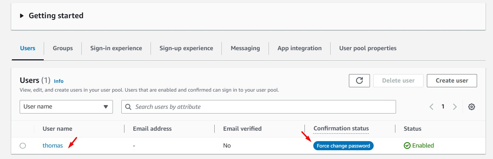

# AWS Solutions Architect Associate - Laboratorio 47

<br>

### Objetivo: 
* Obtención de credenciales temporales STS consumiendo el servicio de Cognito Identity Pool usando AWSCLI

### Tópico:
* Security, Identity & Compliance

### Dependencias:
* Ninguna

<br>

---

### A - Obtención de credenciales temporales STS consumiendo el servicio de Cognito Identity Pool usando AWSCLI

<br>

1. Debemos tener una llave Key Pair disponible. De no ser así, acceder al servicio EC2 y luego a la opción "Key Pair". Generar llave RSA y .pem 

<br>

2. Acceder al servicio AWS Cloud9 y generar un nuevo ambiente de trabajo (Ubuntu 18.04 LTS)

<br>

3. Ejecutar los siguinentes comandos en nuestro Cloud9

```bash
#Ubuntu 18.04
sudo apt-get update
git clone https://github.com/jbarreto7991/aws-solutionsarchitectassociate.git
```
<br>

4. Acceder al laboratorio 47 (Lab-47), carpeta "code". Validar que se cuenta con el archivo "1_lab47-cognito-identitypool.yaml". Analizar el contenido de este archivo

<br>

5. Desplegar la plantilla CloudFormation ejecutando AWSCLI. Considerar los parámetros a ser ingresados.

<br>

6. **1_lab47-cognito-identitypool.yaml**. Esta plantilla tiene por objetivo el despliegue de un recurso "Cognito User Pool" y de un recurso "Cognito Identity Pool". Esta y la siguiente plantilla podrán ser lanzadas en paralelo. Eliminar cualquier recurso "Cognito User Pool" o "Cognito Identity Pool" previamente creado

```bash
aws cloudformation create-stack --stack-name lab47-cognito-identitypool --template-body file://~/environment/aws-solutionsarchitectassociate/Lab-47/code/1_lab47-cognito-identitypool.yaml --capabilities CAPABILITY_IAM
```

<br>

7. **2_lab47-ec2-cognito.yaml**. Esta plantilla contiene los siguientes parámetros de despliegue: KeyPair, SubnetID y VPCID. Reemplazar estos valores en la siguiente línea de comando. Será válido usar la consola de AWS para el despliegue de esta plantilla.

```bash
aws cloudformation create-stack --stack-name lab47-ec2-cognito --template-body file://~/environment/aws-solutionsarchitectassociate/Lab-47/code/2_lab47-ec2-cognito.yaml --capabilities CAPABILITY_IAM  --parameters ParameterKey=KeyPair,ParameterValue="aws-solutionsarchitectassociate" ParameterKey=Subnet,ParameterValue="subnet-43d4a125" ParameterKey=VPC,ParameterValue="vpc-dd59d8a0" --capabilities CAPABILITY_NAMED_IAM
```

<br>

8. Terminado el aprovisionamiento de la primera plantilla de CloudFormation, validar en el servicio Cognito la creación de un recurso "Cognito User Pool" y de un recurso "Cognito Identity Pool (Federated identities)". Revisar las configuraciones desplegadas. 

<br>

9. Accedemos a la instancia EC2 aprovisionada previamente desde la segunda plantilla CloudFormation usando "System Manager - Session Manager", ejecutamos los siguientes comandos. Validar que la instancia esté usando AWSCLIv2. De no reflejarse la versión de AWSCLI correcta, reiniciar la instancia

```bash
#Comando
aws --version

#Resultado
aws-cli/2.11.5 Python/3.11.2 Linux/5.4.0-1078-aws exe/x86_64.ubuntu.18 prompt/off
```

<br>

10. Identificación de Cognito User Pool ID (USERPOOL_ID)

```bash
#Comando
USERPOOL_ID=$(aws cognito-idp list-user-pools --max-results 20 | jq -r '.UserPools[] | .Id')
echo $USERPOOL_ID

#Resultado
us-east-1_tLGjL4s33

#JSON completo sin filtros desde AWS Cognito
{
    "UserPools": [
        {
            "Id": "us-east-1_tLGjL4s33",
            "Name": "Pool-2AwezrlFY5Qi",
            "LambdaConfig": {},
            "LastModifiedDate": "XXXXX",
            "CreationDate": "XXXXX"
        }
    ]
}
```

<br>

11. Creación del usuario "thomas" con contraseña "12345678-Aa". Se visualiza el siguiente resultado. 

```bash
#Comando
aws cognito-idp admin-create-user --user-pool-id  $USERPOOL_ID --username thomas --temporary-password "12345678-Aa" --region us-east-1

#Resultado
{
    "User": {
        "Username": "thomas",
        "Attributes": [
            {
                "Name": "sub",
                "Value": "83edb132-1e98-410f-9c62-8b3abee23db3"
            }
        ],
        "UserCreateDate": "XXXX",
        "UserLastModifiedDate": "XXXX",
        "Enabled": true,
        "UserStatus": "FORCE_CHANGE_PASSWORD"
    }
}
```
<br>

12. Desde la consola de Cognito User Pool, ir a la sección "Users". Se visualiza que el usuario "thomas" en la columna "Confirmation status" tiene el valor "Force change password". Usando AWSCLI obtenemos el valor de USERPOOL_CLIENTID

<br>



<br>

```bash
#Comando
USERPOOL_CLIENTID=$(aws cognito-idp list-user-pool-clients --user-pool-id $USERPOOL_ID | jq -r '.UserPoolClients[] | .ClientId')
echo $USERPOOL_CLIENTID

#Resultado
7bn2lc2olroog9ctku2c32ss6l

#JSON completo sin filtros desde AWS Cognito
{
    "UserPoolClients": [
        {
            "ClientId": "7bn2lc2olroog9ctku2c32ss6l",
            "UserPoolId": "us-east-1_tLGjL4s33",
            "ClientName": "PoolClient-1zjSbKn5k7cL"
        }
    ]
}
```

<br>

13. Loguear el usuario "thomas". Contraseña "12345678-Aa". El resultado solicitará cambio de contraseña

```bash
#Comando
aws cognito-idp initiate-auth --auth-flow USER_PASSWORD_AUTH --client-id $USERPOOL_CLIENTID --auth-parameters USERNAME=thomas,PASSWORD="12345678-Aa" --region us-east-1

#Resultado
{
    "ChallengeName": "NEW_PASSWORD_REQUIRED",
    "Session": "AYABeMyIE799RMDUJRtkdzBBrDgAHQABAAdTZXJ2aWNlABBDb2duaXRvVXNlclBvb2xzAAEAB2F3cy1rbXMAS2Fybjphd3M6a21zOnVzLWVhc3QtMTo3NDU2MjM0Njc1NTU6a2V5L2IxNTVhZmNhLWJmMjktNGVlZC1hZmQ4LWE5ZTA5MzY1M2RiZQC4AQIBAHiG0oCCDoro3IaeecGyxCZJOVZkUqttbPnF4J7Ar-5byAEhW8S6ER0mBE9cMUq_mtR2AAAAfjB8BgkqhkiG9w0BBwagbzBtAgEAMGgGCSqGSIb3DQEHATAeBglghkgBZQMEAS4wEQQMts3TW-bMWR-Z6njEAgEQgDthJDp4EakRhyBqBxcaQMVI4QCYW4rHc0kftYLF4uHuvcf873U9oG-fkTzY5dOLdqtTT9n5NXK437w2jwIAAAAADAAAEAAAAAAAAAAAAAAAAABWmOY6Mi1vOrrU27GSMkPd_____wAAAAEAAAAAAAAAAAAAAAEAAAC2SL7-kMrUyYIbqacVFlt1Cx0P2cfBXb50PqwMZ3PkSX_B8AD-_2QKFDuSfHrcgesGrGODvVHF90OmB7RmulH80_JjUolQRRAhRtgSFz615RWyroU4-QCw2wQ4QHNZNXX0AmKWFdja5RPSpI9OG56wWJjI5ph_0Wc52FWgfmOffIW7agbK1AaoVmRiGiCVnsnkYu-pT2xjH0DKOhBQKdEk927sz2C0OkI8wa_BoWhxbkMxKutpcmX0jHwO4vvYLuA_nyxFqhzN",
    "ChallengeParameters": {
        "USER_ID_FOR_SRP": "thomas",
        "requiredAttributes": "[]",
        "userAttributes": "{}"
    }
}
```

<br>

14. Cambiar la contraseña del usuario "thomas" por "12345678-Bb". Ejecutar los siguientes dos comandos.

```bash
#Comando
SESSION=$(aws cognito-idp initiate-auth --auth-flow USER_PASSWORD_AUTH --client-id $USERPOOL_CLIENTID --auth-parameters USERNAME=thomas,PASSWORD="12345678-Aa" --region us-east-1 | jq -r '.Session')
echo $SESSION

#Resultado
AYABeCHqQ_Ox5H0W58iNFNx0VCgAHQABAAdTZXJ2aWNlABBDb2duaXRvVXNlclBvb2xzAAEAB2F3cy1rbXMAS2Fybjphd3M6a21zOnVzLWVhc3QtMTo3NDU2MjM0Njc1NTU6a2V5L2IxNTVhZmNhLWJmMjktNGVlZC1hZmQ4LWE5ZTA5MzY1M2RiZQC4AQIBAHiG0oCCDoro3IaeecGyxCZJOVZkUqttbPnF4J7Ar-5byAEVB2NoLkwLW-dPgs2TGwHOAAAAfjB8BgkqhkiG9w0BBwagbzBtAgEAMGgGCSqGSIb3DQEHATAeBglghkgBZQMEAS4wEQQMZuQGh5KcB79nQYrQAgEQgDtXc1Wp3pTg-lFKCfyZPJOyWb-BBlZISru6_41G3oyTfgm6XJc0wAlToecdRFE9IViguRXFQfpahtuWmgIAAAAADAAAEAAAAAAAAAAAAAAAAABlFK38abJDbrzkBAEBw8Zd_____wAAAAEAAAAAAAAAAAAAAAEAAAC2QlIvxwCeYc1Syu60oOmFSUrVr7P64LH_b_pxe9MCshrVuUI3k8sV4KLT2FeZ2npa35Fv88n15DUSC_-USCM3Yxce1ReOjoScElNDGt47QS1uBrz2tcvv8wyuQvQjWaIuJmO2Q_7OdG3FgRQ_-PZYoWKgQMiyIDR57keKWFD_yCtNKAFnBo0KpyZUyZ2ilAlxJbUqkjWZ_xrdBfexlKOJkNmxZ1AiHRkSgfjtgXIF5yLnvB6MBijQ-AU7pMWmUAISReMQjvUG

#Comando
aws cognito-idp respond-to-auth-challenge --client-id $USERPOOL_CLIENTID --challenge-name NEW_PASSWORD_REQUIRED --session $SESSION --challenge-responses USERNAME=thomas,NEW_PASSWORD="12345678-Bb" --region us-east-1

#Resultado
{
    "ChallengeParameters": {},
    "AuthenticationResult": {
        "AccessToken": "eyJraWQiOiJWNFk2bHViXC9PM3RUN2htTFNVTlE3QUhmaGdUemtOSmtCRVIwMmVKekNwMD0iLCJhbGciOiJSUzI1NiJ9.eyJzdWIiOiI4M2VkYjEzMi0xZTk4LTQxMGYtOWM2Mi04YjNhYmVlMjNkYjMiLCJpc3MiOiJodHRwczpcL1wvY29nbml0by1pZHAudXMtZWFzdC0xLmFtYXpvbmF3cy5jb21cL3VzLWVhc3QtMV90TEdqTDRzMzMiLCJjbGllbnRfaWQiOiI3Ym4ybGMyb2xyb29nOWN0a3UyYzMyc3M2bCIsIm9yaWdpbl9qdGkiOiJkNTI4YzJkZi04NWE2LTQ4N2ItYjhiNS1mMzkxZDRiYzZlMjUiLCJldmVudF9pZCI6IjRkNTBkZTFiLWNkY2YtNDJmOC1iNjM2LTQ1ZGI2ZWQwNjQzZSIsInRva2VuX3VzZSI6ImFjY2VzcyIsInNjb3BlIjoiYXdzLmNvZ25pdG8uc2lnbmluLnVzZXIuYWRtaW4iLCJhdXRoX3RpbWUiOjE2NjcyNTE0MjcsImV4cCI6MTY2NzI1NTAyNywiaWF0IjoxNjY3MjUxNDI3LCJqdGkiOiI1ZWVmNTc0MC0xNjZhLTRmMzgtODA2OC00NTRhZjFmM2ZiZmEiLCJ1c2VybmFtZSI6InRob21hcyJ9.WfjoG5IP81Y1RzQLDLcrUbqaAaNXVmPTU-KWJikqAKtFeIWw3Atj4txyGUOaddkHjRqPah-oS0YzKBYtAQdVjMBtep_eHCaaaQt3IE-BF37Xtb_yM14MvItmvYlBp7P0CrMozN72zhs21BFsyll4C3uVURlHviuOdNpGfXZymWcjtdgeToIaAbjY1mCk08FKJIH0UJ9ltnIkO-8xEQg6uI_7S3kDiypEB8-dpoBl6wtZh0432MrliA6DQNAJQEMiMadK9nyhHqg4jqsWBgClIADciZCRK6xQ2Dw8qB-W50bBbA-p8ngt5QejWSzpCk3xDfl5zcTMZC9rnuqZePJ-Aw",
        "ExpiresIn": 3600,
        "TokenType": "Bearer",
        "RefreshToken": "eyJjdHkiOiJKV1QiLCJlbmMiOiJBMjU2R0NNIiwiYWxnIjoiUlNBLU9BRVAifQ.GjuIm24PcU9WE7oaka4EznXHsabKWos834rb8VFrj3oAsfgalAc94nIJkWVPwWugoKrukKcnfE32PyWBXhgKB6LpP4adpj63Wg8oJAwXvQjMiufW2uskGeqloprXwmiC9ytcQCujJ21D29NAnfnkWWKizy4QU-koPsmc26AUkenAtvhktmBaSsIjGhMWsbzVtAsUOSSSEdE17E7hvm9dW6wrZ9VtU2XSjBNoRRE-vj3EtJyIkLI9i_1OPXZV1tWRSJr_rtZDRdixT84GMrtGZoj0tCSHxl_nnixGXPx1eDzeH58HCXhA2hSGO9HpJ_JGoQFKWgubiVpcL64A5QX-AA.w8QI_dLGieEscH-K.1QV2BqvhQfFfbKEtgHj1a0syoUhhgcZk8D1d12HHDuIZDgxDXepvkHAfG4hd5ppruYkDUfp4_pfeofteitj1MW1_Gdyz-fDK0PNO76SslKO-E29dUmqO_phh32WyHh99Su3olBuWNE4ukPck7k76psgoINBMUbDeQ55divFwDa1iTktbiJKzma4yBEM984wTxLSJvdHDanoT1JHA12gkiMJYq4Rt3_mZI-w76l8ZLBy6CtztPu8k4W7wkieZOPC1pmjBeztAs0d84BsOp6uDIU0mVknYL9pixAnlBeBdcQlFIGaN46ldFYnVi9wUK0-W-rawhZxFj1Si1SeKNeqfrdMlA_sJRzPnwD_D_EP8ckkvzfOK4DdsgbDBn6IvaailgfsZ8N68s1E6WQ_EN4ZgJQlu9gBycsQl-p5kTcBE8eEh1L-NEqQLh3rVLquYbi9UgLwhVsChFSVUbr3bhksuv2r97FPaE8zfZ-PF8dDMJg7gt8C3xfZbhIXi1uFxEA8tnHk2wGUXbSM5AGFV06T7TVtd-zRQrLu5KuObVUn_oPVtwiJLboxUrG8-rHs195KOc2KnjMOh7uH60T_5UJpQPCVfBIRKXiLcLdCFvc2DlEutoS55PNWFiLH0wZw-O-bevDdPMI3epJB4NeDiWVX9quQfhDmmRLZOg5elkQ6u_bd1DJ47e_2vZxbH1QYGzo38YZpDD3w4p-jJBMsjmX9tXvpn0Y6EU8TuQUDK_FfoViglLEIiFEr-kF34JY4JxxhO7qy3yuzhrKVbozgfY1nXmNYHQ0StYKiBLi653GX7DFPpNX8I6DNPXWHYb_8vzSAALc1WfEEOWQnL7YQfMrqYAb9qSM0VDhlHBoAKZkczmikrVlQLoWY2SqK8NR_cS5mELIuxUVzvGIjZNi96HjMnsLKiL2rXEkJy9-q6UzgOTLyCPcdcopK8NB6eYvRZhq1q7DU2pGLohF0xupZ4-Bsrd6burvKryqex2Ix62bVr3jtHrWmnY9VpnjDeIxf2sHBKNr1d9Q0jET_urXz9shbB23AHMndH53_Z3zpDLwYVsm9DhPIgRS6QEDC56rY38bvqaCcLY4M911GiNZf2mpkxlcGO7Zj8Z8GJMhYjaMX3BDdCKNGroqdNV23U_Wm2tPcPV84SsXkGA83omn99BkklZrX7igwazgoLBUS7of5OIm_Iftkb_B3ko7oeNhKj7ESGv2HUyCQcIHSi6gj0SN89xT-W_O5X2eGxr9Ca9OAYrL2_RrIqYfzKygAtGr4nZnMqku3X_Q.xWUBkRgkKw4OUSoN3f9B6A",
        "IdToken": "eyJraWQiOiJOZDRqSlFldjZcLzBISUxYc3lidVRTOEhYZEJZN3R6YUk2WVk3eElFNEw3QT0iLCJhbGciOiJSUzI1NiJ9.eyJvcmlnaW5fanRpIjoiZDUyOGMyZGYtODVhNi00ODdiLWI4YjUtZjM5MWQ0YmM2ZTI1Iiwic3ViIjoiODNlZGIxMzItMWU5OC00MTBmLTljNjItOGIzYWJlZTIzZGIzIiwiYXVkIjoiN2JuMmxjMm9scm9vZzljdGt1MmMzMnNzNmwiLCJldmVudF9pZCI6IjRkNTBkZTFiLWNkY2YtNDJmOC1iNjM2LTQ1ZGI2ZWQwNjQzZSIsInRva2VuX3VzZSI6ImlkIiwiYXV0aF90aW1lIjoxNjY3MjUxNDI3LCJpc3MiOiJodHRwczpcL1wvY29nbml0by1pZHAudXMtZWFzdC0xLmFtYXpvbmF3cy5jb21cL3VzLWVhc3QtMV90TEdqTDRzMzMiLCJjb2duaXRvOnVzZXJuYW1lIjoidGhvbWFzIiwiZXhwIjoxNjY3MjU1MDI3LCJpYXQiOjE2NjcyNTE0MjcsImp0aSI6IjA1MWM4ZDAzLWE2MGUtNGIzYi05ZjcwLWFkZGQzMDBjNTc0NSJ9.Kj4sgdcJN3-52S-PbqsPNmb9y93V7xPjCgKFHF04zYfrDH-ZSQfnVStr200rGM-lRlZDI__xL2lmaDJmrZnfwozKjAz-d_Gi0CnMTI3yjH09HrsO28Utkjg2ZYYxKB7nMt-x3JB1MuQAfYxjI2U7ywGuYxe4dDMBcYjYhmg-YMuNedXSXZCwz_WKDASKA16eoxbjFpNNzgTeXmzzrnqZGeraqsB1-zcsZzZgwB3NuiFV-CxPsgzGn1BAqjqBxY3L4xYHowmncMnLz-U2H0fhiwYDIg5sI7LuVKL6uWlepF7WTRamiv0YPwcUfgsn0sjqeTYW1-jiyn32Jf9dPgDGfw"
    }
}
```

<br>

15. Loguear al usuario "thomas" con la nueva contraseña. Obtener el campo IdToken manualmente del resultado del siguiente comando. Luego, almacenar en la variable "USERPOOL_IDTOKEN" este campo. Considerar:

    * En Amazon Cognito User Pool, hay tres tipos de tokens que se utilizan en el flujo de autenticación: AccessToken, RefreshToken e IdToken. Cada uno de ellos tiene un propósito diferente y proporciona diferentes tipos de información.

        * *AccessToken:* Este token se utiliza para acceder a los recursos protegidos que están asociados con el usuario autenticado. Es un token de acceso temporal que se concede al usuario después de una autenticación exitosa. El AccessToken se utiliza para autorizar solicitudes de API de backend, por ejemplo, para acceder a recursos de Amazon S3, DynamoDB, entre otros. Este token tiene una vida útil limitada y su duración puede ser configurada en Amazon Cognito.
        * *RefreshToken:* Este token se utiliza para obtener un nuevo AccessToken después de que el AccessToken original haya expirado. El RefreshToken se emite durante la autenticación inicial y se utiliza para solicitar un nuevo AccessToken sin necesidad de que el usuario vuelva a ingresar sus credenciales. El RefreshToken es un token de acceso de larga duración y su vida útil puede ser configurada en Amazon Cognito.
        * *IdToken:* Este token es un JWT (JSON Web Token) que contiene información del usuario autenticado y se utiliza para la verificación del usuario en el lado del cliente. Proporciona información sobre el usuario, como su identidad, correo electrónico, nombre, entre otros. El IdToken es utilizado por el cliente (aplicación web o móvil) para autenticar solicitudes a recursos protegidos, por ejemplo, para acceder a recursos de una API de backend.


```bash
#Comando
aws cognito-idp initiate-auth --auth-flow USER_PASSWORD_AUTH --client-id $USERPOOL_CLIENTID --auth-parameters USERNAME=thomas,PASSWORD="12345678-Bb" --region us-east-1

#Resultado
{
    "ChallengeParameters": {},
    "AuthenticationResult": {
        "AccessToken": "eyJraWQiOiJWNFk2bHViXC9PM3RUN2htTFNVTlE3QUhmaGdUemtOSmtCRVIwMmVKekNwMD0iLCJhbGciOiJSUzI1NiJ9.eyJzdWIiOiI4M2VkYjEzMi0xZTk4LTQxMGYtOWM2Mi04YjNhYmVlMjNkYjMiLCJpc3MiOiJodHRwczpcL1wvY29nbml0by1pZHAudXMtZWFzdC0xLmFtYXpvbmF3cy5jb21cL3VzLWVhc3QtMV90TEdqTDRzMzMiLCJjbGllbnRfaWQiOiI3Ym4ybGMyb2xyb29nOWN0a3UyYzMyc3M2bCIsIm9yaWdpbl9qdGkiOiJlYmE4ZjViMy1lNzRiLTQ3MDItYWRiNi04ZDQ3OTk5NDJjZmEiLCJldmVudF9pZCI6IjBjNGJkNzM5LTlmZDctNDdjZS05MWQyLWMzYmVhOGU4ODA0NyIsInRva2VuX3VzZSI6ImFjY2VzcyIsInNjb3BlIjoiYXdzLmNvZ25pdG8uc2lnbmluLnVzZXIuYWRtaW4iLCJhdXRoX3RpbWUiOjE2NjcyNTE0OTMsImV4cCI6MTY2NzI1NTA5MywiaWF0IjoxNjY3MjUxNDkzLCJqdGkiOiI0ZWQwZTI2ZS0zYTA3LTQ3ZDQtYWI3NS00OWMyZTk4NGUyNWQiLCJ1c2VybmFtZSI6InRob21hcyJ9.OKbPPPYrLbCl6BNO6r4M15d_fAjImc8vvxc8sqMnGIRbPqPT30B35q4-zc59XZCBlYAMpdhO798Cbmd7oOM4Rqizi9I34lV-BqrE4mt9nbaAPf-O-xRn5VVQ1bY8PSLPIEqWeXD0h_wkKCjmMlqQnvHbTN53SgA80KjygBjjZu6UcyLMPkNAU-drZ8GmXH6-trhjuwnVaCOdIWld8jEjPuCrFh1amOS3dnXAHUmhOLKuPxITGiaUwcR7cLgHDlGNzYzb0miMBD9b1bBqx_vmLtZrzK9MdRBmuBCsysznYV9SMh8miyFxpUWwV-bkxa9BN63d9aqOP5sIKs6dL-7haw",
        "ExpiresIn": 3600,
        "TokenType": "Bearer",
        "RefreshToken": "eyJjdHkiOiJKV1QiLCJlbmMiOiJBMjU2R0NNIiwiYWxnIjoiUlNBLU9BRVAifQ.i9mytxhT-CKs7pEipwPlzoZVoXSr0ffIw72uI87o_Jfkshep_RFftN5vt2k0_qz8YnyNAmiaw5XCUX48gAUA7KWs_bO1jrLH1_Q6mnUhewrtTMl83fUAaGusljmDM9gUT_MKB6IIHmA1f8EYbP03y2F7PlBccLViIfIwqJSI3AyeT4KYk5yrNzr_pPZo0Lwly-EOdZAXyGbEe1nx0vqHjAb_Iqy420gnsQccJXn5vCd2aME8qCF6l4d-hpFtF_m9b2EUhG115f5y6cIVeUhyv-j_sY5T6n29o9l5qRRbWHjiBzbF8TtEBffGixB3ZlJyabNTd4Gxl269OqD-7ysiGA.h5eCIHtmdzZIcdsl.d8IL-DNZM3OL49EEt30Qqst1Np_OyEkkJ_o9KD_fpk9wBRGRs57KZWr1KQvF8F7jU9t-AnDTwh7VJqfFi3tkrWxehX6fM2QtdsWnxo48gAqeWBhKXNsCyNFl0a8y1nCo0pZQoFpb6gMHto4THHLozdIQL9GtFtHgoF5aS0i6urXwnKOeCcx2gKKVEqZEvGstBCc7PoeoixfYI3egTLsBlCeDYP0924pgN9iUh3udj0ripopltd1gvHMKK-PidvmgySxspGN7HjJ6_V8JisMk7PKvkQBTawvHs8PDKbSZaiuTDNy8NjKsBq0gUNfaq6bhx47hsou_jNcwpLz-jgzphZVoRwFeHTDNL9DWE5KNB37vInIaZvQFp_23CLJbR4SUrK2-1wd5feF2ZL5cz5-opY0IKu7hAv-5tYu7fIxrrGjkw41FtKDD2aE8WF253iseYwiUJeDDRKm4Duvb1ZYXZRo9g73ZwTAMwkwk8MmutJqnZciJkz0KVlxdWU2oNSq4HAAIfWZdr7dzmpH9R6A35MujxQusUUZy0DtIvHGTbcQHNMDk6Be6cODWQuGmZM6bokmZoWH9fOIkVOET0oIPpACqPBfzMSn_AvTHWZV6Q2WYTRjw6bl11lPHqNk7wu2MgIJOE-_m68_7ohnkpUmQSfx07R7U2VE65Ck5xsBE-nlVeh9HX1q_1A3OQV5U-MqSJW244MQAICh8X3937ZRHcMlfTrb8bAmn8AuLMZNMjo0x_rtPQ4HHXEeBhiYiFRXqAmUgSOG3WgcX5f_JfmGCaPcoO86OuVVVYekiMC-pT0Ov7Hhky6crG_x0QOBwFDI6Fzk9myYymfGX_DvGHMzGcj2UiXayqxfz61X2ImnaE5Jl1-hUELT9v4KBzn2pLyC3C-9JNKuOvVa-F7lVu1Kqu6xlR0mj0e7v3eLIUDx4MdiAYokOkLTbRjHP6hM4RtjeULxf9Z0ap0h_vxkeX0qBXoYohmEeev3OAmWE5OGS1ohlB01Ero1dPwD3onfD0VYn9pIgbIrimhG8tkunztWLeNyxiAx4_TAOCSzPLS8lKGiHiMRwibvyJaYmsKsPwAyq8bFUDrHfIB178FpXgUPjev4bZDeJ9ePcJ6yDzG_AmiSGQL2Q3nwK9odqlp4bR2ZQGcCLN1h9bmbhrPoGbeIkbtHGTQwuYjeafh4bQ3HuoFMiR-cnbVP6fbRdc9Ns20eigv3TnIkMk3nZMdqrljU-_ojHXKbHaCbOGhB9R_V9XV3SfpeY3_mc0udroMlflhdrIHCKuw.OKz6vr10oKU7Y_zEFxzA1Q",
        "IdToken": "eyJraWQiOiJOZDRqSlFldjZcLzBISUxYc3lidVRTOEhYZEJZN3R6YUk2WVk3eElFNEw3QT0iLCJhbGciOiJSUzI1NiJ9.eyJvcmlnaW5fanRpIjoiZWJhOGY1YjMtZTc0Yi00NzAyLWFkYjYtOGQ0Nzk5OTQyY2ZhIiwic3ViIjoiODNlZGIxMzItMWU5OC00MTBmLTljNjItOGIzYWJlZTIzZGIzIiwiYXVkIjoiN2JuMmxjMm9scm9vZzljdGt1MmMzMnNzNmwiLCJldmVudF9pZCI6IjBjNGJkNzM5LTlmZDctNDdjZS05MWQyLWMzYmVhOGU4ODA0NyIsInRva2VuX3VzZSI6ImlkIiwiYXV0aF90aW1lIjoxNjY3MjUxNDkzLCJpc3MiOiJodHRwczpcL1wvY29nbml0by1pZHAudXMtZWFzdC0xLmFtYXpvbmF3cy5jb21cL3VzLWVhc3QtMV90TEdqTDRzMzMiLCJjb2duaXRvOnVzZXJuYW1lIjoidGhvbWFzIiwiZXhwIjoxNjY3MjU1MDkzLCJpYXQiOjE2NjcyNTE0OTMsImp0aSI6IjIzODc3ZjNlLTVhOTEtNDQyMS05MWE4LTRkMGNiNDk2MWRiNCJ9.XxZYFhBi8qBLvXAm3jWmnqe2kX7QUufTQtB-gPIYfkA5Emgq3F2jPILbOR097zWZbVvMjWiF0UT2bjmo1UHYm--oVPEILJnDTz1GI43pHO7mKjapsscoaYBSHsV2mAPa53Y2i3bUgf0DzZahNfNEbkLHLTAEhvDDG26QpdPCQS3hr0J6tgev5Nje-H_p1RhTn0g5xp6U6eDrXEV8UgwVbQo2He5obo-DpHS31I8suNNGtGrb5lKqVy7DOtQ228GNBCctzzllVbYmw66HvHpDgUxc_jx4iGo6-HyFRol48mIXprz7cPWgIXPAy2A3GE7kspi3zsrLDb-VTqkPQGxJag"
    }
}
```

<br>

```bash
#Obtener el campo IdToken manualmente
USERPOOL_IDTOKEN="eyJraWQiOiJOZDRqSlFldjZcLzBISUxYc3lidVRTOEhYZEJZN3R6YUk2WVk3eElFNEw3QT0iLCJhbGciOiJSUzI1NiJ9.eyJvcmlnaW5fanRpIjoiZWJhOGY1YjMtZTc0Yi00NzAyLWFkYjYtOGQ0Nzk5OTQyY2ZhIiwic3ViIjoiODNlZGIxMzItMWU5OC00MTBmLTljNjItOGIzYWJlZTIzZGIzIiwiYXVkIjoiN2JuMmxjMm9scm9vZzljdGt1MmMzMnNzNmwiLCJldmVudF9pZCI6IjBjNGJkNzM5LTlmZDctNDdjZS05MWQyLWMzYmVhOGU4ODA0NyIsInRva2VuX3VzZSI6ImlkIiwiYXV0aF90aW1lIjoxNjY3MjUxNDkzLCJpc3MiOiJodHRwczpcL1wvY29nbml0by1pZHAudXMtZWFzdC0xLmFtYXpvbmF3cy5jb21cL3VzLWVhc3QtMV90TEdqTDRzMzMiLCJjb2duaXRvOnVzZXJuYW1lIjoidGhvbWFzIiwiZXhwIjoxNjY3MjU1MDkzLCJpYXQiOjE2NjcyNTE0OTMsImp0aSI6IjIzODc3ZjNlLTVhOTEtNDQyMS05MWE4LTRkMGNiNDk2MWRiNCJ9.XxZYFhBi8qBLvXAm3jWmnqe2kX7QUufTQtB-gPIYfkA5Emgq3F2jPILbOR097zWZbVvMjWiF0UT2bjmo1UHYm--oVPEILJnDTz1GI43pHO7mKjapsscoaYBSHsV2mAPa53Y2i3bUgf0DzZahNfNEbkLHLTAEhvDDG26QpdPCQS3hr0J6tgev5Nje-H_p1RhTn0g5xp6U6eDrXEV8UgwVbQo2He5obo-DpHS31I8suNNGtGrb5lKqVy7DOtQ228GNBCctzzllVbYmw66HvHpDgUxc_jx4iGo6-HyFRol48mIXprz7cPWgIXPAy2A3GE7kspi3zsrLDb-VTqkPQGxJag"

echo $USERPOOL_IDTOKEN
```

<br>

16. Obtener el valor del campo "IdentityId" (IDENTITYPOOL_ID)

```bash
#Comando
IDENTITYPOOL_ID=$(aws cognito-identity list-identity-pools --max-results 10 | jq -r '.IdentityPools[] | .IdentityPoolId')
echo $IDENTITYPOOL_ID

#Resultado
us-east-1:cfec93b5-76f7-4650-80ad-ff5a9c4244c3

#JSON completo sin filtros desde AWS Cognito
{
    "IdentityPools": [
        {
            "IdentityPoolId": "us-east-1:cfec93b5-76f7-4650-80ad-ff5a9c4244c3",
            "IdentityPoolName": "IdPool_a1SxrBj9MuiH"
        }
    ]
}
```

<br>

```bash
#Comando sin filtros
aws cognito-identity get-id --identity-pool-id $IDENTITYPOOL_ID --logins cognito-idp.us-east-1.amazonaws.com/$USERPOOL_ID=$USERPOOL_IDTOKEN --region us-east-1

#Resultado
{
    "IdentityId": "us-east-1:2d2e1dae-637c-4cb7-9771-c2f040291aae"
}
```

<br>

17. Obtener credenciales desde STS ejecutando los siguientes dos comandos. Al finalizar la ejecución del último comando visualizaremos las variables "AccessKeyId", "SecretKey", "SessionToken" y "Expiration".

```bash
#Comando
IDENTITYPOOL_IDENTITYID=$(aws cognito-identity get-id --identity-pool-id $IDENTITYPOOL_ID --logins cognito-idp.us-east-1.amazonaws.com/$USERPOOL_ID=$USERPOOL_IDTOKEN --region us-east-1 | jq -r '.IdentityId')
echo $IDENTITYPOOL_IDENTITYID

#Resultado
us-east-1:2d2e1dae-637c-4cb7-9771-c2f040291aae

#Comando
aws cognito-identity get-credentials-for-identity --identity-id $IDENTITYPOOL_IDENTITYID --logins cognito-idp.us-east-1.amazonaws.com/$USERPOOL_ID=$USERPOOL_IDTOKEN

#Resultado
{
    "IdentityId": "us-east-1:2d2e1dae-637c-4cb7-9771-c2f040291aae",
    "Credentials": {
        "AccessKeyId": "XXXXXXXXQB4XMHJVSS3Z",
        "SecretKey": "AAAAAAAAAYq14dadNBo+hSdGvC64UJvABBBBBBBB",
        "SessionToken": "AAAAAAAA2luX2VjEJb//////////wEaCXVzLWVhc3QtMSJHMEUCIBKzt4pYjA383g0NIEBrqCkPRcrpcUoCe/O7LDlk6dqhAiEA8ErT5O2o7W9siXAy6YXOkWrrsLPjheBJPBGc0b+QHnwqxAQIfxABGgwwNjgyNDIzNzg1NDIiDJaxid+KEwpNQ36ojSqhBIAtiD3H0HZSqMa3ZnZJ+r5oJIA0zJoPc16sITVOGEJiCCCCCCCCA0NRa2CWWCof4kG5TPRD0T0ijqBKi05vDUl6Nry8RAwYVC5Rm2AMIbIHVi2W1wY4dPVerMhJBt2l5yj8WiqV+2QiuvReiN/Y8n2HlsHrF6tgwKNA+tE8aBWpaiQUbb9Vvjot/GhAdXRh0iXIZtZyIliX/HfTwvnsotWu5j0Isk+nEEMXqzA1kSE/q/h8I8WRZGldeWP/kqxqV8xwbc6FxGSm1UjbMZks5Bm7zxjGU+ezt+cQgmK9ASwC4ZJMvfiNYzzsDLCyPhJgScvhYSQP5+YSlMLVRHjreIqKTE8lcj49cE7ADC9u3ZP+zRNVcaMdoayv0wsDbNft2LFOziSmP7OixjyYVw6Mi4SMjWPNKXhP+WZNMtqIp2HovZkTo2Q+3NIrxA2mcB7wNUmHCXkPes6aylVMvPF4js5W1xNfJzH4viz1bcUIJdZqddpPJ8bxoOVUpU51CJN0jLfwiHY+OEDLOULnhSCEHLlzh4lzJFczhXQxgH28BvJT7umpnTQFMTb8rvwnW1dx80j3V3yUxKvXvIaFozxWCdeAZzQcR3uU79OpHshEUykekMHbvCrk1IQRpuj3XBNpBPnLWWGMuiQ/cwLaYxBnX+g1mXRSpwkrABYJ4XfUAxaEjBWo/aCcff7HpTa0Hk4w+JxSt3Vkt64F1+6QFUmZTyRNMP77gJsGOoUCYrAkfvH5d1sv1VqoCFgSMLVZIMC12E383bmMs5I2/LlBc7f/3/G+bkRLme2Pe5gNRuNHAl5JsrLqVWMYBmkq/CseyVGJHf6X+gEKASLJ8KH6pREz1gjilr+vsjjwCGmHHP2rtYp7pWJRIOJqbSUKJPtSlQ4z9WBhSmdUMF+JrCljdocpKOrfj/ziGPyi6bCJ6i5TxE5oPzop88izF3MO6jWsTpNHVx81GUYNsvTVEFmLPXj6Xi5PYaa1thpWgFNIeyD9GONI76B4x56s278lVyzAaiZv3TIwZoX9V8W+Ln8X412dbQ0ZDWeSkQ9Ki9gFtVuzCUwXzydiWqGenwQOBBBBBBBB",
        "Expiration": "XXXXXXXX"
    }
}
```

<br>

### Eliminación de recursos

```bash
aws cloudformation delete-stack --stack-name lab47-cognito-identitypool
aws cloudformation delete-stack --stack-name lab47-ec2-cognito
```
