# AWS Solutions Architect Associate - Laboratorio 48

<br>

### Objetivo: 
* Integración de Cognito Identity Pool y ALB (Application Load Balancer) a través de ALB Tokens

### Tópico:
* Compute
* Security, Identity & Compliance

### Dependencias:
* Ninguna

<br>

---

### A - Integración de Cognito Identity Pool y ALB (Application Load Balancer) a través de ALB Tokens


<br>

1. Debemos tener una llave Key Pair disponible. De no ser así, acceder al servicio EC2 y luego a la opción "Key Pair". Generar llave con configuración "RSA" y ".pem" 

<br>

2. Acceder al servicio AWS Cloud9 y generar un nuevo ambiente de trabajo (Ubuntu 18.04 LTS)

<br>

3. Ejecutar los siguinentes comandos en nuestro Cloud9

```bash
#Ubuntu 18.04
sudo apt-get update
git clone https://github.com/jbarreto7991/aws-solutionsarchitectassociate.git
```

<br>

4. Acceder al laboratorio 48 (Lab-48), carpeta "code". Validar que se cuenta con tres archivos CloudFormation: "1_lab48-vpc.yaml", "2_lab48-ec2.yaml" y "3_lab48_alb_targetgroup". Analizar el contenido de estos archivos.

<br>

5. Desplegar cada plantilla CloudFormation ejecutando AWSCLI. Considerar los parámetros a ser ingresados.

<br>

6. **1_lab48-vpc.yaml** (Esperar el despliegue total de esta plantilla cloudformation para continuar con las siguientes plantillas). En la sección "ParameterValue", ingresar el nombre del KeyPair creado en el paso 1. Esta plantilla creará la VPC "192.168.0.0/16", 06 Subnets dentro de este CIDR, un NAT Instances y demás componentes de red. No deberán existir redes existentes en este rango de IPs. Validar la creación del Stack desde la consola AWS a través del servicio AWS CloudFormation. El siguiente comando considera el valor "aws-solutionsarchitectassociate" para el KeyPair, reemplazar el nombre según la llave respectiva.

```bash
aws cloudformation create-stack --stack-name lab48-vpc --template-body file://~/environment/aws-solutionsarchitectassociate/Lab-48/code/1_lab48-vpc.yaml --parameters ParameterKey=KeyPair,ParameterValue="aws-solutionsarchitectassociate" --capabilities CAPABILITY_IAM
```

<br>

7. **2_lab48-ec2.yaml** (Esperar el despliegue total de esta plantilla cloudformation para continuar con la siguiente plantilla). En la sección "Parameters", ingresar el nombre del KeyPair creado en el paso 1. Esta plantilla creará una instancia EC2 en la subnet privada AZ A

```bash
aws cloudformation create-stack --stack-name lab48-ec2 --template-body file://~/environment/aws-solutionsarchitectassociate/Lab-48/code/2_lab48-ec2.yaml --parameters ParameterKey=KeyPair,ParameterValue="aws-solutionsarchitectassociate" --capabilities CAPABILITY_IAM
```

<br>

8. En el despliegue de recursos a través de CloudFormation se han generado 6 subnets: 2 subnets públicas (a ser usadas por el BALANCEADOR), 2 subnets privadas (donde ha sido desplegada "PROD BACKEND AZ A") y otras 2 subnets privadas que actualmente no tiene uso, pero serán destinadas en los siguientes laboratorios para la base de datos.

<br>

9. **3_lab48-alb-targetgroup.yaml**. Esta plantilla no tiene parámetros por ingresar. Generará un target group y un balanceador de aplicaciones. Además, las instancias EC2 se asociarán al target group en el puerto 80.

```bash
    aws cloudformation create-stack --stack-name lab48-alb-targetgroup --template-body file://~/environment/aws-solutionsarchitectassociate/Lab-48/code/3_lab48-alb-targetgroup.yaml
```

<br>

10. **1_lab47-cognito.yaml**. Esta plantilla tiene por objetivo el despliegue de un recurso "Cognito User Pool" y de un recurso "Cognito Identity Pool".

```bash
aws cloudformation create-stack --stack-name lab48-cognito --template-body file://~/environment/aws-solutionsarchitectassociate/Lab-48/code/4_lab48-cognito.yaml --capabilities CAPABILITY_IAM
```

<br>

11. Generamos un certificado SSL para nuestro balanceador ALB, desde el servicio "Certificate Manager", a través del método de validación "DNS Validation". Registrar CNAME entregados en Route 53. Detalle de creación paso a paso en el Lab-14.

<br>

12. Desde el servicio Route 53, crear un registro alias hacia el ALB. 

<br>


<br>

13. Acceder al servicio de Cognito, luego al "User Pool" generado, ir a la sección "App integration", sección "Domain" y dar clic en la opción "Actions > Create Cognito domain". Ingresar un nombre en el campo "Cognito domain" y dar clic en el botón "Create cognito domain". Tener en cuenta lo siguiente "Domain prefixes may only include lowercase, alphanumeric characters, and hyphens. You can't use the text aws, amazon, or cognito in the domain prefix. Your domain prefix must be unique within the current Region"

<br>

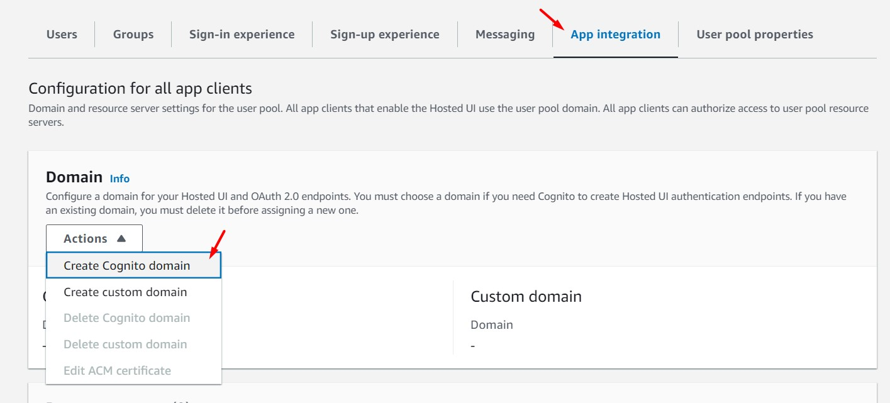

<br>

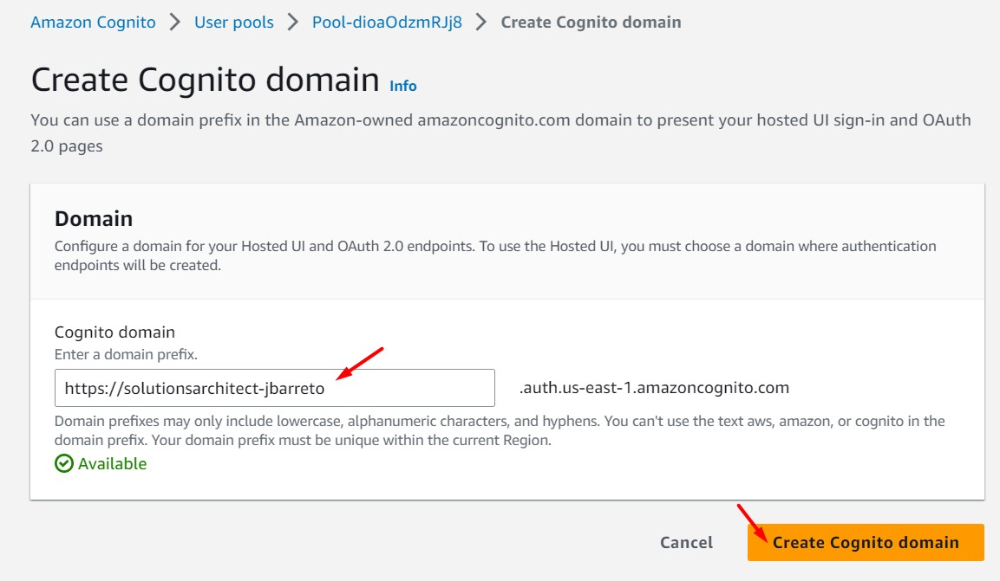

<br>

14. Desde el servicio Cognito, ir a la sección "App integration - App client list", eliminar la configuración mostrada. Dar clic en la opción "Create app client". Ingresar/seleccionar los siguientes valores. Considerar otros valores de esta sección por defecto.

    * App type: Public client
    * App client name: myclientapp
    * Client secret: Generate a client secret

<br>

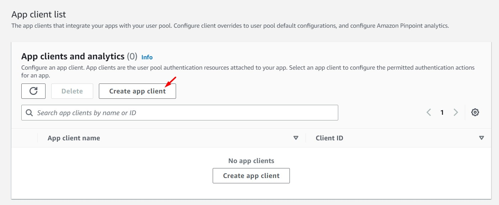

<br>

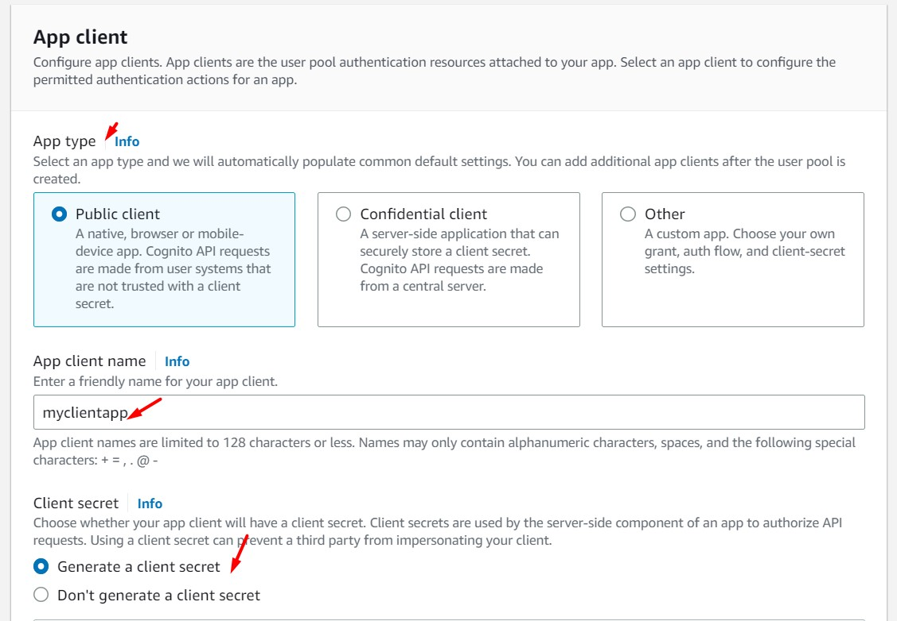

<br>

15. Desde la misma página, ir a la sección "Hosted UI settings" e ingresar/seleccionar los siguientes valores. Al finalizar, dar clic en el botón "Create App Client".

    * Allowed callback URLs
        * URL: https://<DOMAIN_ROUTE53_ALB>/oauth2/idpresponse
    * Identity providers: Cognito user pool
    * OAuth 2.0 grant types: Authorization code grant
    * OpenID Connect scopes: 
        * Email
        * OpenID

<br>

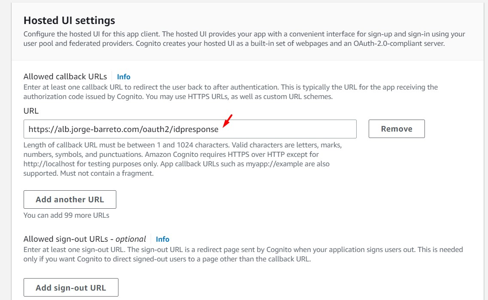

<br>
 
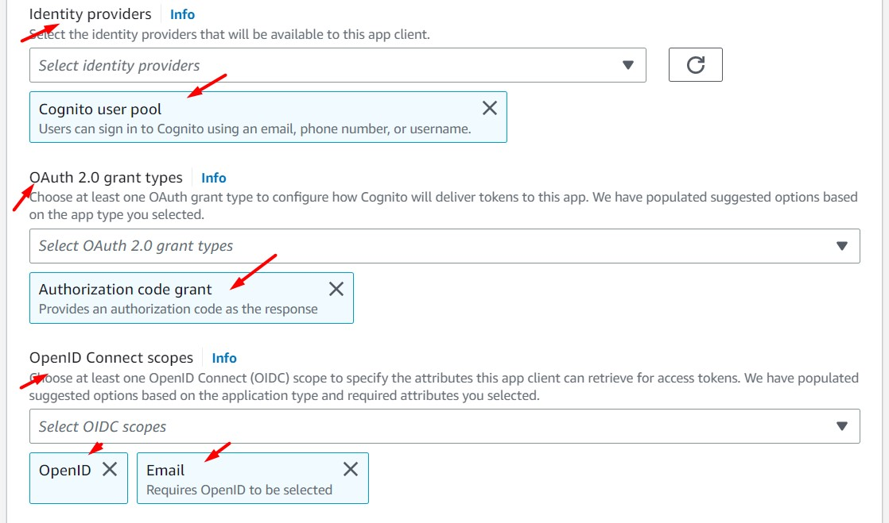

<br>
 
16. Desde el features del ALB, agregar el listener 443 a través de la opción "Listeners > Add listener"

    * Listener details
        - Protocol: HTTPS
        - Port: 443
        - Default actions: 1. Forward to
            - Target group: Seleccionar Target Group respectivo (EC2LoadBalancerTargetGroupApp)
        - Secure listener settings
            - Security policy: ELBSecurityPolicy-TLS13-1-2-2021-06 (Recommended)
        - Default SSL/TLS certificate
            - From ACM: Seleccionar el certificado generado en el paso 11

<br>

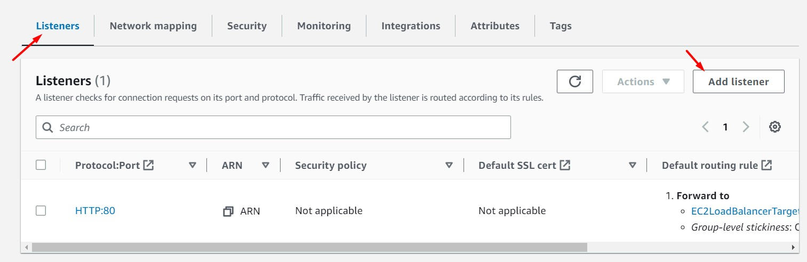

<br>

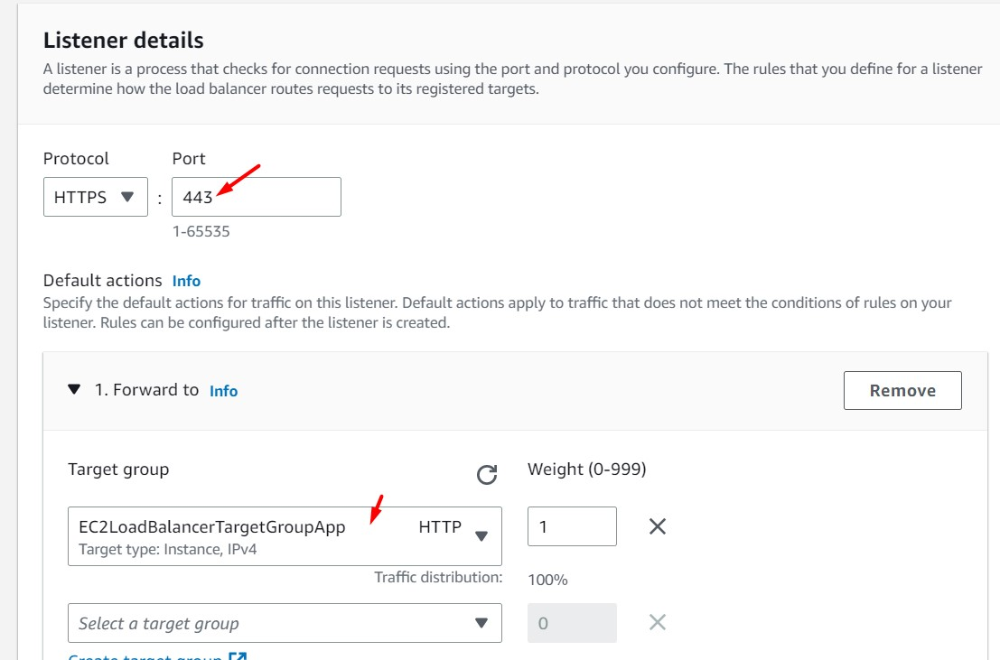

<br>

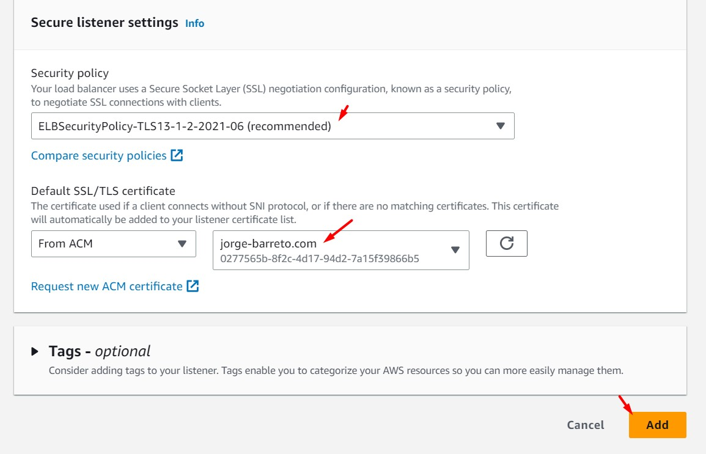

<br>

17. Desde esa misma ventana, dar clic en el botón "Add action > Authenticate". Al finalizar la configuración dar clic en el botón "Add"

    - Default actions: 1. Authenticate
        - Identity provider - optional: Amazon Cognito
        - Cognito user pool: Seleccionar "Cognito User Pool"
        - App client: Seleccionar "App Client"
        - Cognito user pool domain: Se cargará automáticamente
        - Advanced settings (Visualizar los siguientes valores por defecto):
            - Session cookie name: AWSELBAuthSessionCookie
            - Session timeout: 604800
            - Scope: openid
            - Action on unauthenticated request: Authenticate (client reattempt)

<br>

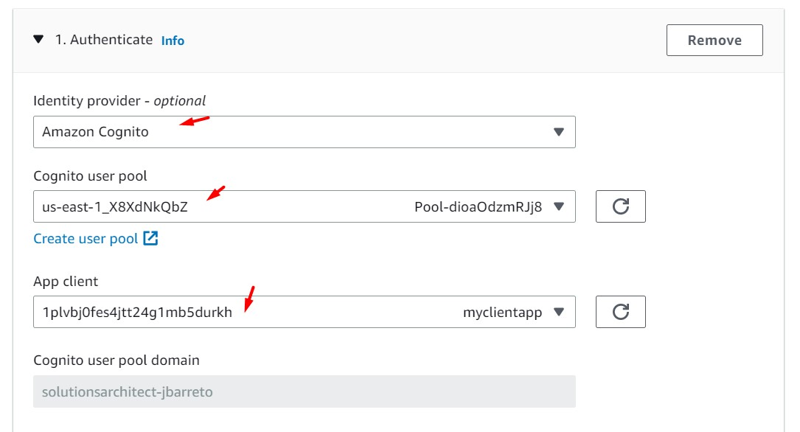

<br>

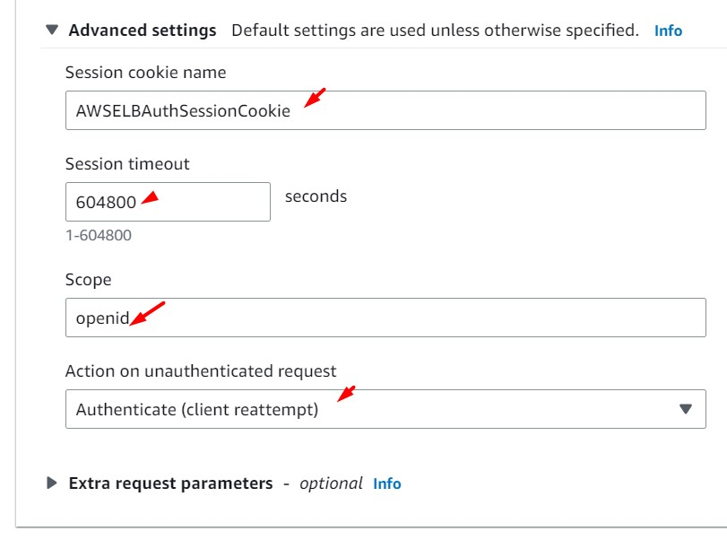

<br>

18. Desde la web, ingresamos al dominio del balanceador generado en el paso 12. Validamos que existe un direccionamiento hacia el login de Cognito.

<br>

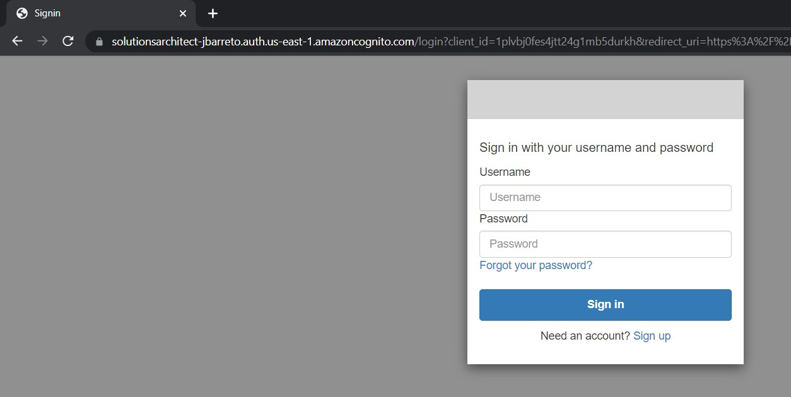

<br>

19. Desde el servicio Cognito, procedemos a crear un usuario. La contraseña del usuario deberá contener una mayúscula, minúscula, número y un caracter especial.

<br>

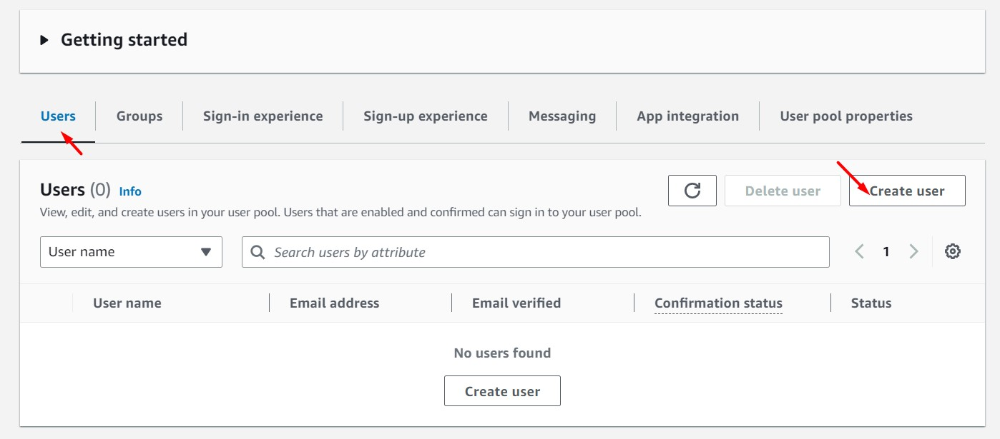

<br>

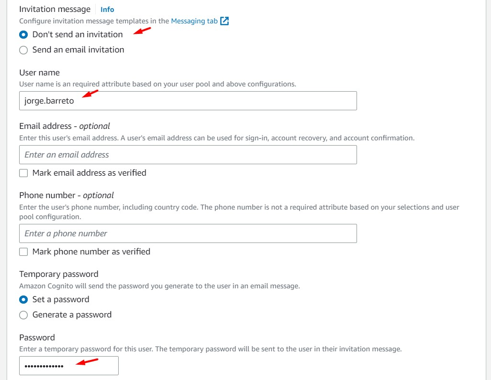

<br>

20. Nos logueamos al login detallado en el paso 18 con el usuario generado en el paso anterior y validamos que se nos solicita cambio de contraseña. Al ingresar la nueva contraseña y dar clic en el botón respectivo, podemos visualizar el contenido de nuestra aplicación servida desde ALB. Analizar la existencia del header "AWSELBAuthSessionCookie"

<br>

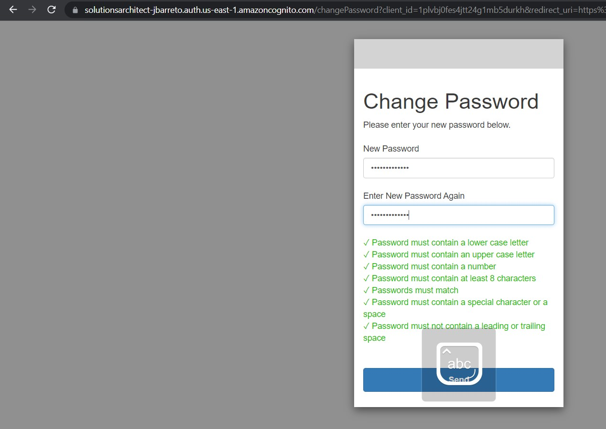

<br>

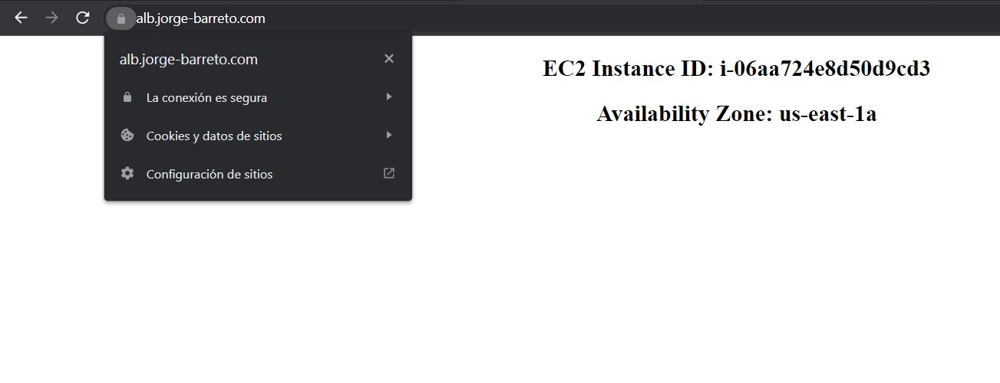

<br>

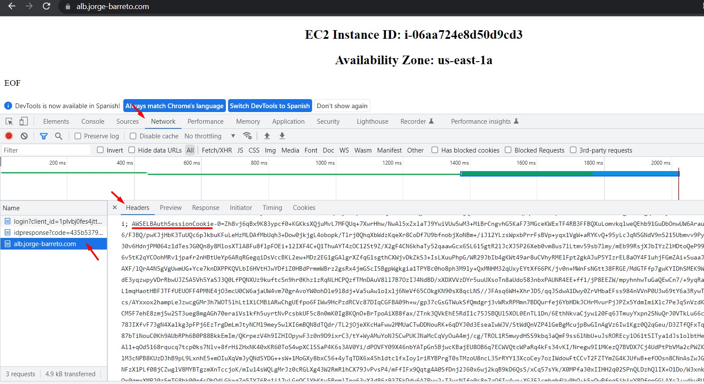

<br>


---

### Eliminación de recursos

```bash
aws cloudformation delete-stack --stack-name lab48-cognito
aws cloudformation delete-stack --stack-name lab48-alb-targetgroup
Eliminar Target Group
aws cloudformation delete-stack --stack-name lab48-ec2
aws cloudformation delete-stack --stack-name lab48-vpc
```