# AWS Solutions Architect Associate - Laboratorio 50

<br>

### Objetivo: 
* Integrar los eventos de CloudTrail y Event Bridge 
* Automatizar la respuesta ante incidentes en usuarios IAM usando Lambda y SNS

### Tópico:
* Compute
* Security, Identity & Compliance
* Management & Governance
* Application Integration

### Dependencias:
* Ninguna

<br>

---

### A - Integrar los eventos de CloudTrail y Event Bridge. Automatizar la respuesta ante incidentes en usuarios IAM usando Lambda y SNS

<br>


1. Ingresamos al servicio "IAM" opción "User" y creamos el usuario IAM "aws-architectassociate" con las siguientes características:

    - User name: aws-architectassociate
    - Provide user access to the AWS Management Console - optional: No
    - Set permissions: Attach existing policies directly
        - Policy name: AdministratorAccess

<br>

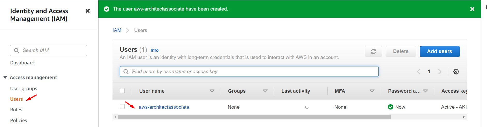

<br>

2. Ingresamos al servicio CloudTrail. Desde la opción "Event History" observaremos diferentes tipos de eventos ("AttachUserPolicy" y "CreateUser"). Realizamos un filtro por: "Resource type: AWS:IAM:User". Validamos los siguientes eventos (para que los eventos del usuario creado anteriormente puedan listarse se deberá esperar de 2 a 3 minutos antes de realizar esta acción)

<br>

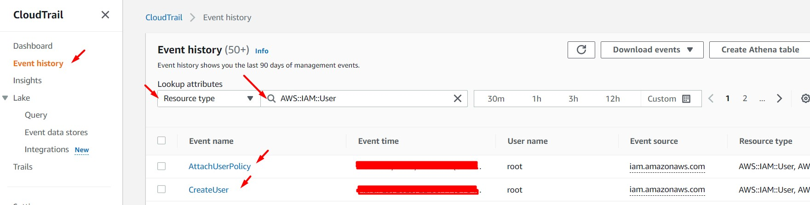

<br>

3. Ingresamos al evento "AttachUserPolicy" y analizamos el JSON. Este evento tiene por objetivo indicarnos la política asociada al usuario (Ver Key "requestParameters")

```bash
{
    "eventVersion": "1.08",
    "userIdentity": {
        "type": "Root",
        "principalId": "XXXXXXXXXXXX",
        "arn": "arn:aws:iam::XXXXXXXXXXXX:root",
        "accountId": "XXXXXXXXXXXX",
        "accessKeyId": "AAAAAAAAAB4XBBBBBBBB",
        "userName": "<USER_NAME>",
        "sessionContext": {
            "sessionIssuer": {},
            "webIdFederationData": {},
            "attributes": {
                "creationDate": "XXXX-XX-XXTXX:XX:XXZ",
                "mfaAuthenticated": "true"
            }
        }
    },
    "eventTime": "XXXX-XX-XXTXX:XX:XXZ",
    "eventSource": "iam.amazonaws.com",
    "eventName": "AttachUserPolicy",
    "awsRegion": "us-east-1",
    "sourceIPAddress": "AWS Internal",
    "userAgent": "AWS Internal",
    "requestParameters": {
        "userName": "aws-architectassociate",
        "policyArn": "arn:aws:iam::aws:policy/AdministratorAccess"
    },
    "responseElements": null,
    "requestID": "29d04a84-99d2-4848-bbbc-aaaaaaaaaaaa",
    "eventID": "5a0c2945-cb17-4fbd-a80c-aaaaaaaaaaaa",
    "readOnly": false,
    "eventType": "AwsApiCall",
    "managementEvent": true,
    "recipientAccountId": "XXXXXXXXXXXX",
    "eventCategory": "Management",
    "sessionCredentialFromConsole": "true"
}
```
<br>

4. Ingresamos al servicio Lambda y creamos una Función Lambda con las siguientes características:
    - Function name: AttachUserPolicy
    - Runtime: Python 3.9
    - Permissions: Create a new role with basic Lambda permissions
    - Create function

<br>

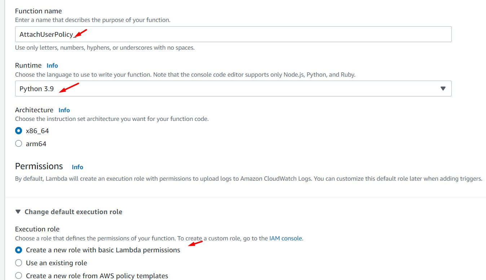

<br>

5. Desde el servicio SNS, generamos un Tópico "Standard". Generamos una subscripción "Protocol: Email". Aceptar la subscripción desde el email recepcionado en nuestra bandeja de entrada.

<br>

6. Agregamos el siguiente código a nuestra Función Lambda. Reemplazar el valor "<ARN_SNS_TOPIC>" por el ARN del Tópico SNS creado en el paso anterior.

```bash
import json
import boto3

#Conexión a AWS Services
iam = boto3.client('iam')
sns = boto3.client('sns')

def lambda_handler(event, context):
    # TODO implement
    print(event)
    print(context)

    """Obtener el nombre del usuario IAM y la politica asociada"""
    userName = event['detail']['requestParameters']['userName']
    policyArn = event['detail']['requestParameters']['policyArn']
    print(userName)
    print(policyArn)
    
    if policyArn=="arn:aws:iam::aws:policy/AdministratorAccess":
        detach_user_policy(userName,policyArn)
        message = {
            'userName': userName,
            'policyArn': policyArn,
            'message': 'Usuario con permisos de AdministratorAccess identificado',
            'action': 'Eliminar permiso AdministratorAccess del usuario'
        }
        publish_message(message)
        print("OK")
    else:
        pass
        

def detach_user_policy(username, policy_arn):
    response_iam=iam.detach_user_policy(
        UserName=str(username),
        PolicyArn=str(policy_arn)    
    )
    print(response_iam)
    print(f"Politica {policy_arn} desasociada del usuario {username}")

def publish_message(message): 
    response_sns = sns.publish(
        TargetArn="<ARN_SNS_TOPIC>",
        Message=json.dumps({'default': json.dumps(message)}),
        MessageStructure='json'
    )
    print(response_sns)
```

<br>

7. Desde el servicio IAM, buscamos el rol asociado a la Función Lambda previamente creada y le asociamos los siguientes permisos:

    - IAMFullAccess
    - AmazonSNSFullAccess

<br>

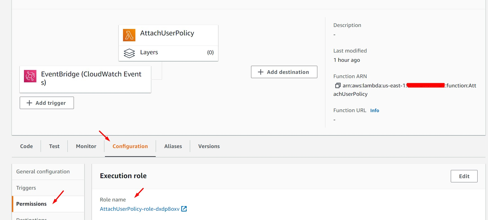

<br>

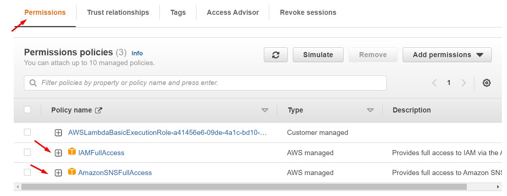

<br>

8. Ingresamos al servicio "EventBridge" y damos clic en la opción "Rules - Create Rules". Seleccionamos/ingresamos las siguientes opciones:

    - Name: AttachUserPolicy
    - Event Bus: default
    - Rule type: Rule with an event pattern
    - Event source: AWS events or EventBridge partner events
    - Event pattern
        - Event source: AWS Services
        - AWS service: IAM
        - Event type: AWS API Call via CloudTrail
        - Specific operation(s): AttachUserPolicy
    - Select target(s)
        - Target types: AWS service
        - Select a target: Lambda function
        - Function: AttachUserPolicy

<br>

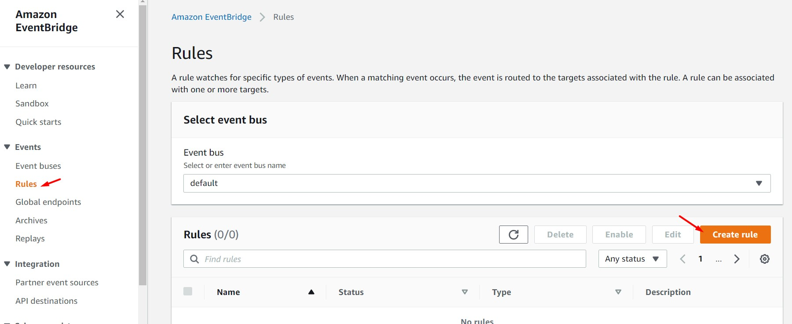

<br>

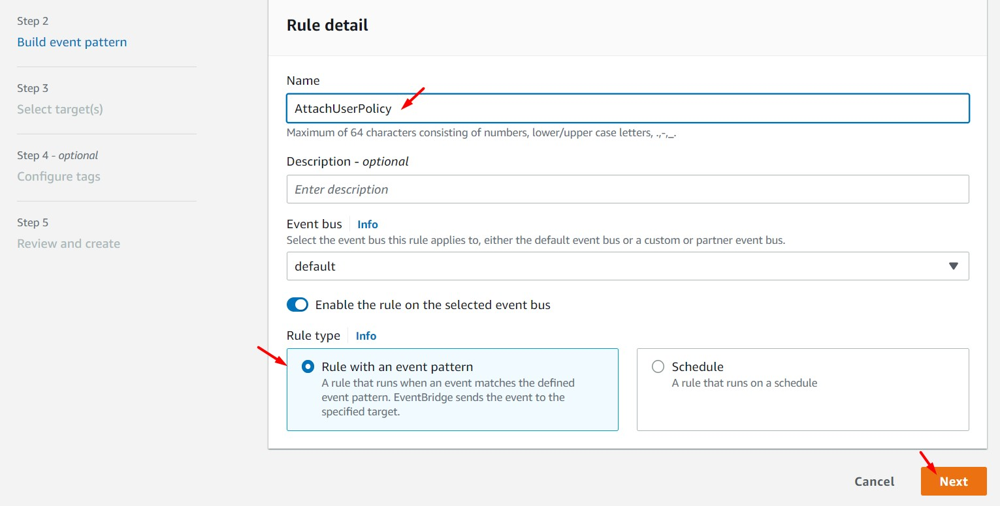

<br>

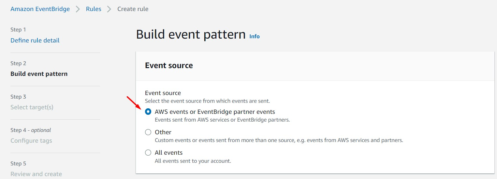

<br>

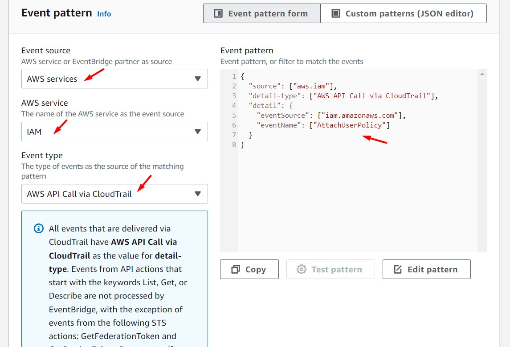

<br>

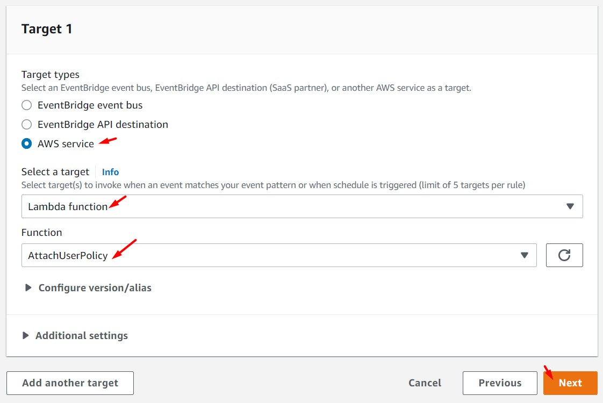

<br>

9. Desde el servicio IAM creamos un usuario con las siguientes características:

    - User name: aws-architectassociate-2
    - Provide user access to the AWS Management Console - optional: No
    - Set permissions: Attach existing policies directly
        - Policy name: AdministratorAccess

<br>

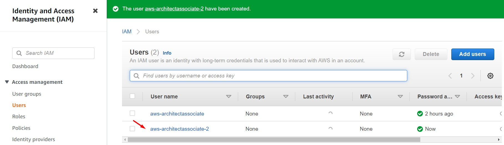

<br>

10. Realizaremos los siguientes pasos de validación en el usuario IAM "aws-architectassociate-2":

    - Se recepcionó un correo electrónico
    - Análisis de la política asociadas al usuario "aws-architectassociate-2". Se valida que se eliminó la política "AdministratorAccess" asociada al usuario
    - Revisión de los logs generados por la Función Lambda

<br>

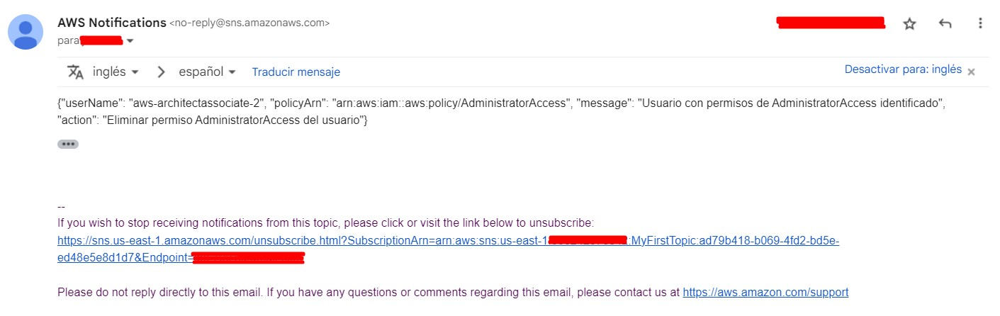

<br>

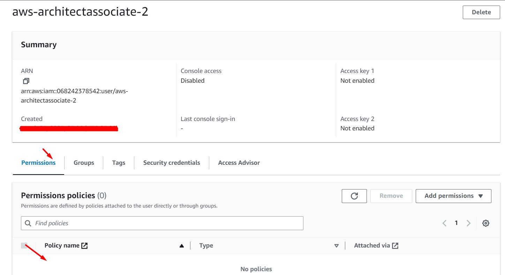

<br>

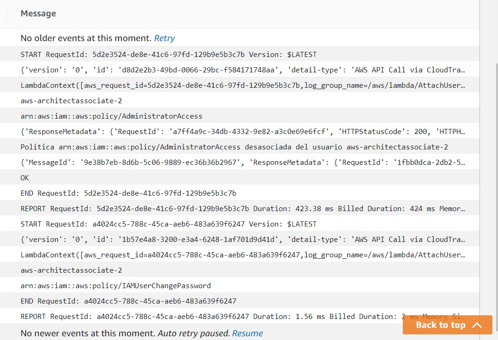

<br>

11. Desde el servicio IAM creamos un usuario con las siguientes características:

    - User name: aws-architectassociate-3
    - Provide user access to the AWS Management Console - optional: No
    - Set permissions: Attach existing policies directly
        - Policy name: ReadOnlyAccess (Buscar está política en la última hoja de la lista)


<br>


12. Realizaremos los siguientes pasos de validación en el usuario IAM "aws-architectassociate-3":
    - No se recepcionó algún correo electrónico
    - Análisis de políticas asociadas al usuario "aws-architectassociate-3". Se mantiene la política "ReadOnlyAccess" en el usuario
    - Revisión de los logs generados por la Función Lambda

<br>

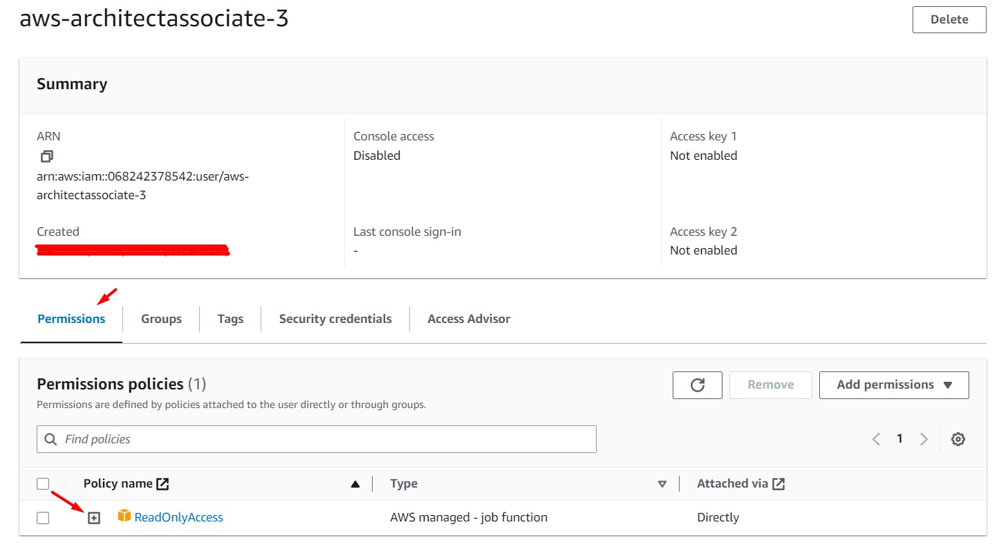

<br>

---

### Eliminación de recursos

```bash
#Eliminar IAM Users "aws-architectassociate", "aws-architectassociate-2" y "aws-architectassociate-3" en "IAM"
#Eliminar Trail en "CloudTrail"
#Eliminar función Lambda "AttachUserPolicy" en "Lambda"
#Eliminar tópico en "SNS"
#Eliminar Event Rules "AttachUserPolicy" en "Event Bridge" 
```
