# AWS Solutions Architect Associate - Laboratorio 51

 

### Objetivo: 
* Habilitación del servicio "AWS IAM Identity Center (AWS Single Sign-On)" en AWS Organizations
* Configuración de IAM Identity Center (successor to AWS Single Sign-On)

### Tópico:
* Security, Identity & Compliance
* Management & Governance

### Dependencias:
* Implementación del laboratorio 22

 

---

### A - Habilitación del servicio "AWS IAM Identity Center (AWS Single Sign-On)" en AWS Organizations

 

1. Como paso previo de este laboratorio, deberemos tener activo "AWS Organizations" y tener como mínimo dos cuentas administradas por AWS Organizations (Este paso se desarrolla en el Laboratorio 22).

 

2. Accedemos al servicio de AWS Organizations. Ingresamos a la opción "Services" y damos clic sobre "AWS IAM Identity Center (AWS Single Sign-On)". Luego habilitamos el servicio.

 

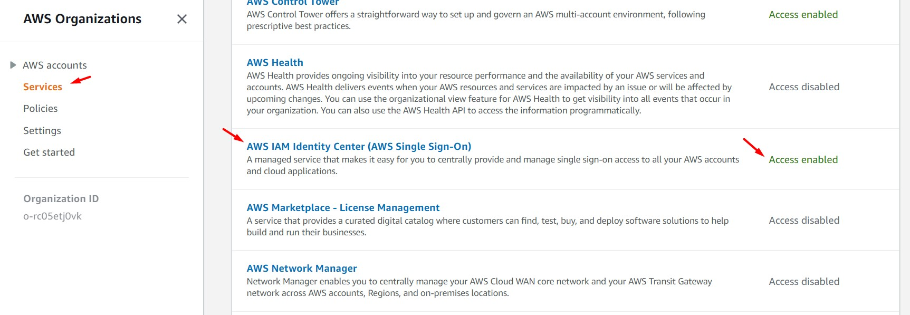

 

### B - Configuración de IAM Identity Center (successor to AWS Single Sign-On)

 

3. Accedemos al servicio "IAM Identity Center (successor to AWS Single Sign-On)" y damos clic en el botón "Enable". Esperamos unos segundos.

 

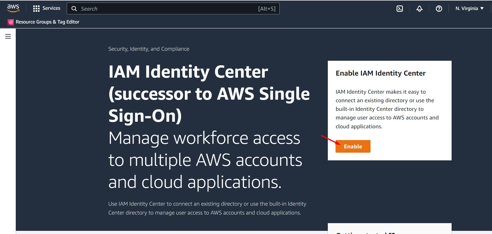

 

4. Accedemos a la opción "Groups" y damos clic en el botón "Create Group". Crearemos los siguientes dos grupos:

    - Administradores
    - SoloLectura

 

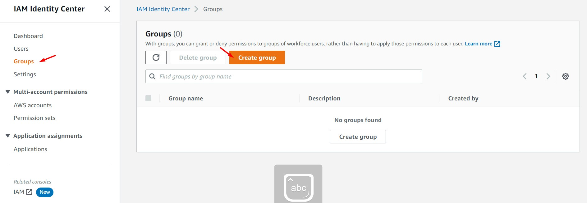

 

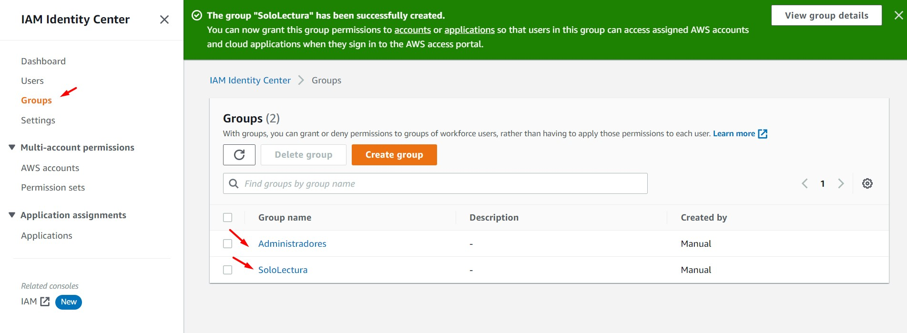

 

5. Accedemos a la opción "Settings", opción "Identity source" y damos clic sobre la opción "Actions - Customize AWS accesss portal URL". Ingresamos un identificador como dominio. Para este ejemplo hemos seleccionado el dominio "aws-solutionsarchitect". Copiamos el valor del campo "AWS access portal URL" y lo pegamos en un navegador oculto u otro navegador.

 

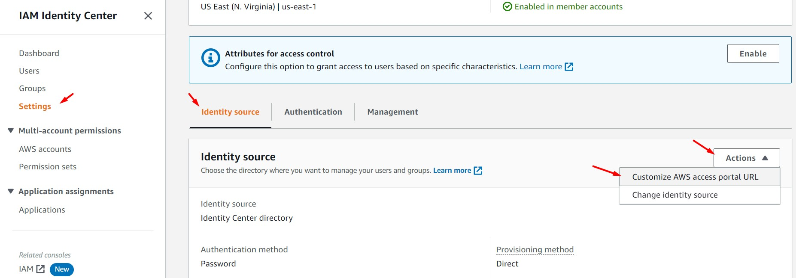

 

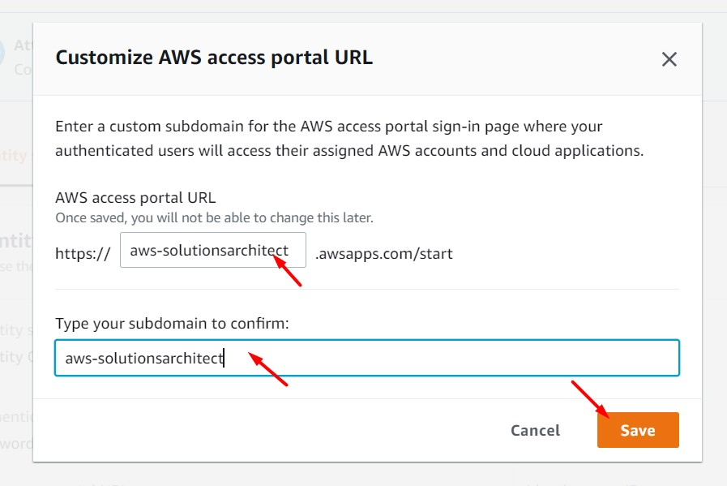

 

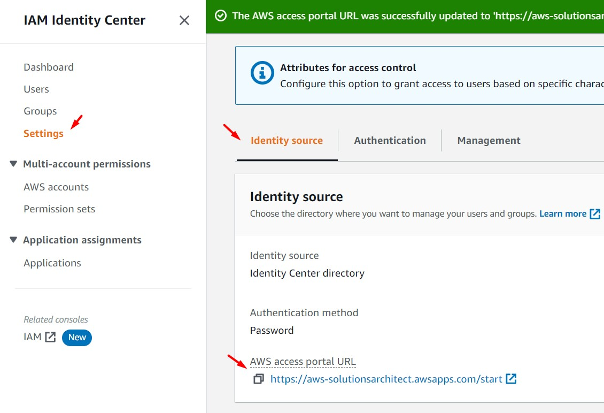

 

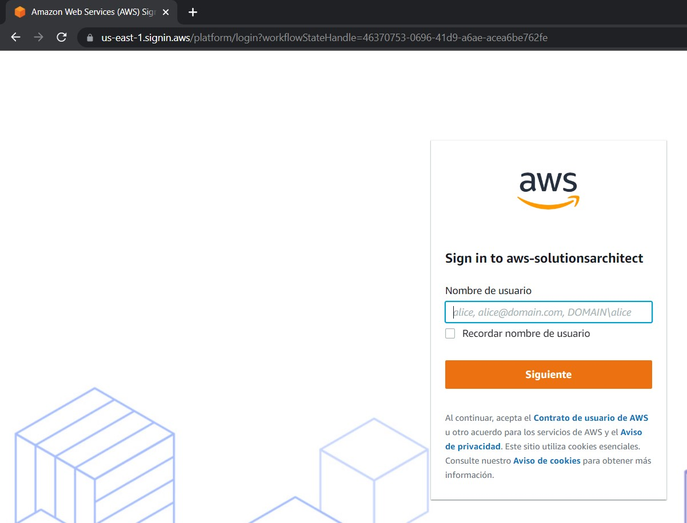

 

6. Accedemos a la opción "User" y damos clic en el botón "Add User". Ingresamos la siguiente información solicitada y damos clic en el botón "Next". Asociar al grupo respectivo. Finalizada la creación del usuario, se nos mostrará las credenciales de acceso, copiar estas en un archivo de texto plano.

    - Username: user_administrador
    - Password: Generate a one-time password that you can share with this user.
    - Email address
    - Confirm email address
    - First name
    - Last name
    - Group name: Administradores

 

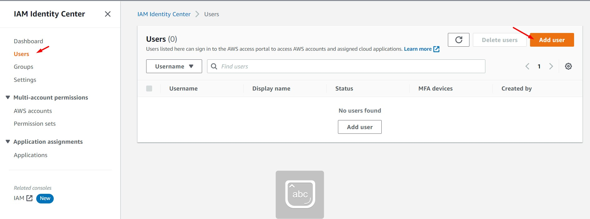

 

7. Agregar al usuario "user_sololectura" asociado al grupo "SoloLectura". AWS IAM Identity Center solicitará que cada usuario esté asociado a un correo electrónico diferente. Finalizada la creación del usuario, se nos mostrará las credenciales de acceso, copiar estas en un archivo de texto plano.

 

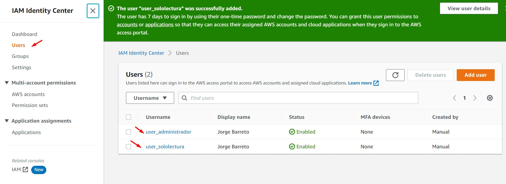

 

8. Desde nuestro navegador accedemos a la URL del portal de AWS IAM Identity Center y nos logueamos. Después de solicitarnos el cambio de contraseña, podremos acceder al portal. Aún no tenemos cuentas AWS asociadas a nuestro usuario de IAM Identity Center.
  
 

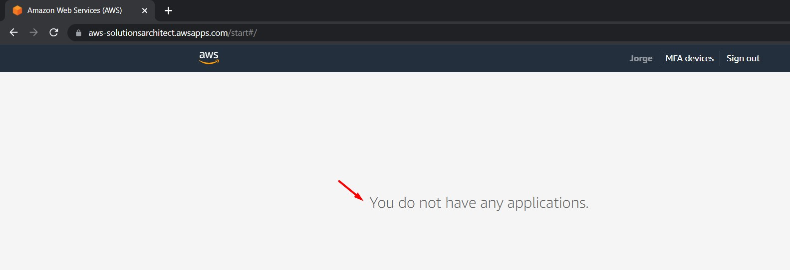

 

9. Accedemos a la opción "Permission sets" y damos clic en el botón "Create permission set". Realizamos las siguientes configuraciones:

    * Configuración 01
        - Permission set type: Predefined permission set
        - Policy for predefined permission set: AdministratorAccess
        - Permission set name: AdministratorAccess

    * Configuración 02
        - Permission set type: Predefined permission set
        - Policy for predefined permission set: ViewOnlyAccess
        - Permission set name: ViewOnlyAccess

 

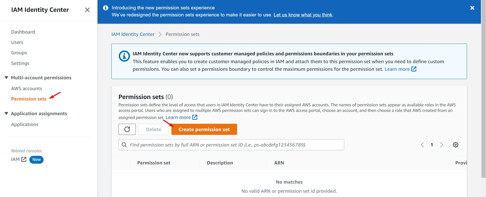

 

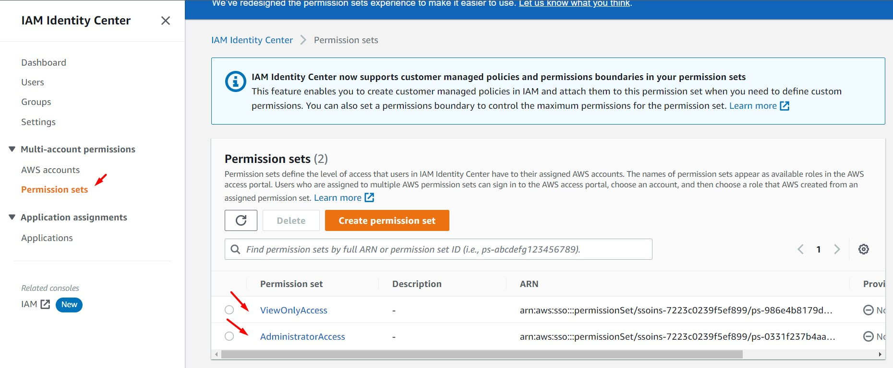

 

10. Accedemos a la opción "AWS Accounts", podremos visualizar todas las cuentas asociadas a nuestra organización. Seleccionamos las cuentas deseadas y damos clic en el botón "Assign users or groups". 

 

 

11. Seleccionamos el Group Name "Administradores" y seleccionamos el Permission Set "AdministratorAccess". Luego, realizamores la misma configuración para el Group Name "SoloLectura" y el Permission Set "ViewOnlyAccess". 

 

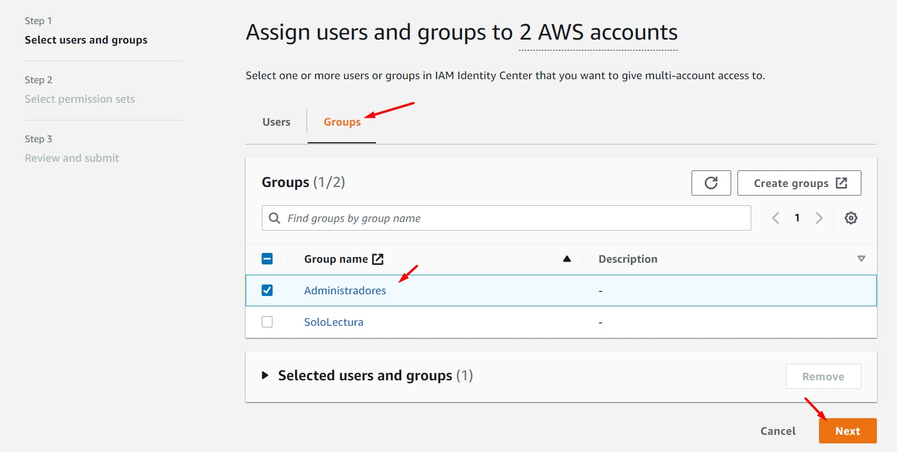

 

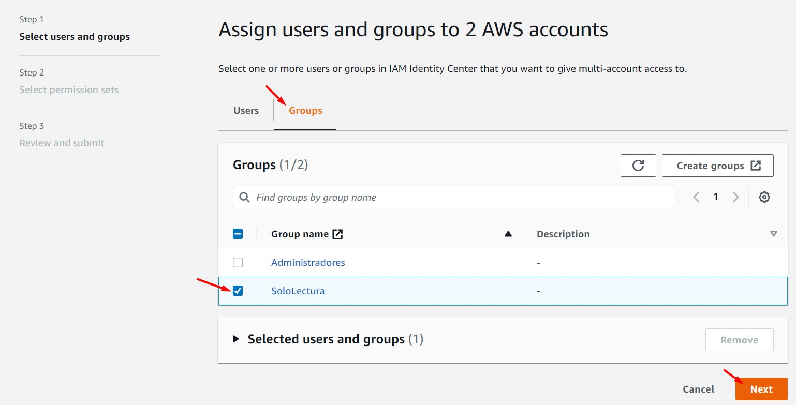

 

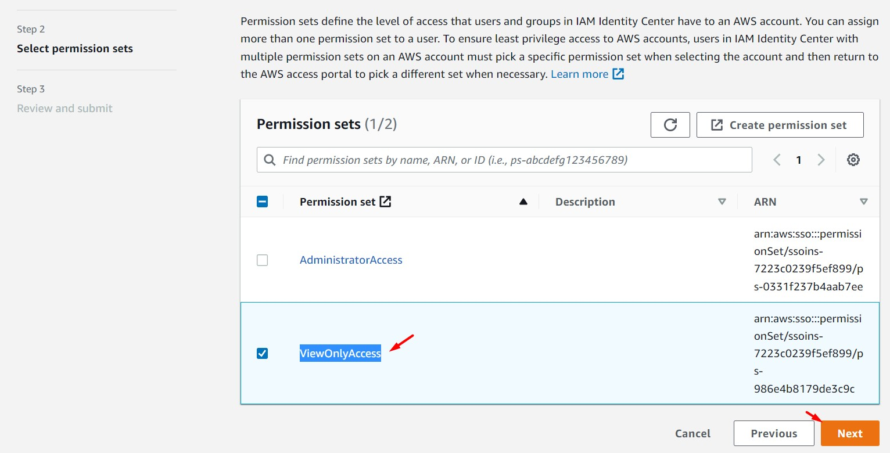

 

12. Accedemos a nuestro portal y validaremos que tenemos acceso a nuestras cuentas seleccionadas. Realizar pruebas ingresando con los usuarios "user_administrador" y "user_sololectura". Validar que el usuario "user_sololectura" tiene accesos de solo lectura.

 

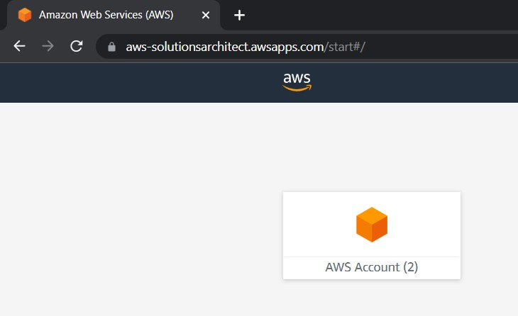

 

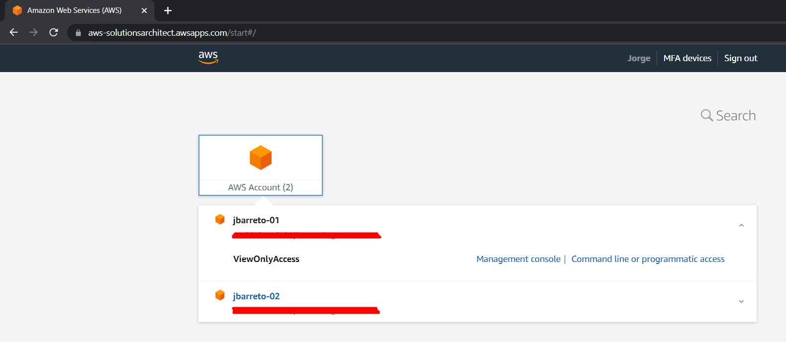

 

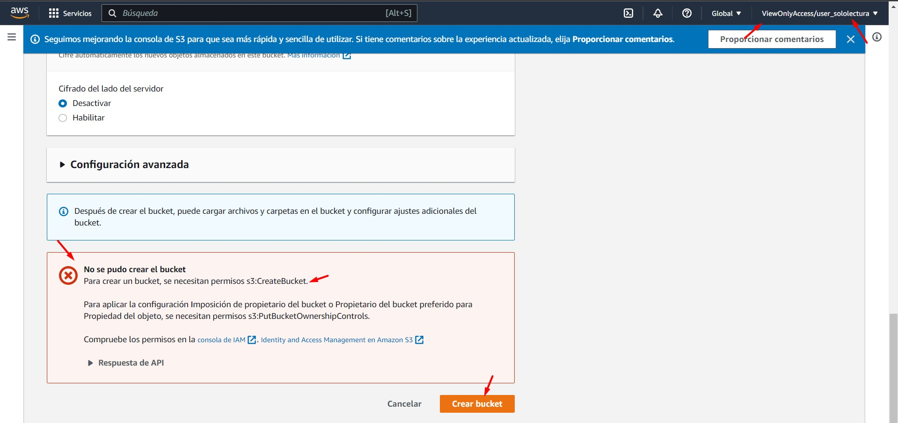

 