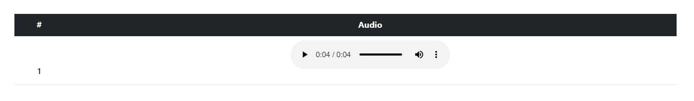

# AWS Solutions Architect Associate - Laboratorio 53

<br>

### Objetivo: 
* Interactuar con la API de Amazon Polly


### Tópico:
* Machine Learning

### Dependencias:
* Ninguna

<br>

---

### A - Interactuar con la API de Amazon Polly

<br>

1. Acceder al servicio AWS Cloud9 y generar un nuevo ambiente de trabajo (Ubuntu 18.04 LTS). Todo el siguiente laboratorio deberá realizar en la región N. Virginia (us-east-1)

<br>

2. Ejecutar los siguientes comandos. El último comando (python3 polly.py) tiene por objetivo generar el archivo "speech.mp3", el mismo que contiene el audio. Este audio se almacenará en la ruta "/tmp"

```bash
#Commands
sudo apt-get update
sudo apt-get install software-properties-common
sudo apt-add-repository universe
sudo apt-get update
sudo apt-get install python3-pip
pip3 install boto3

git clone https://github.com/jbarreto7991/aws-solutionsarchitectassociate.git

#Copy index.html and polly.py in this directory
cp ~/environment/aws-solutionsarchitectassociate/Lab-53/code/* .

#Python Execution
python3 polly.py
```
<br>

3. Generaremos un bucket S3 de nombre parcialmente aleatorio. En este bucket subiremos los archivos "speech.mp3" e "index.html". El archivo "speech.mp3" se generará como producto de la ejecución del archivo "polly.py". Los archivos "index.html" y "polly.py" se encuentran dentro de la carpeta "/code". El bucket S3 usará la propiedad "Static WebSite Hosting" para servir como página web.

```bash
#Commands

var=$RANDOM
BUCKET=aws-architect-solutions-$var
aws s3 mb s3://$BUCKET
#aws s3api create-bucket --bucket $BUCKET --region us-east-1

BUCKET=$(aws s3 ls | sort -r | awk 'NR ==1 { print $3 }')

aws s3 website s3://$BUCKET/ --index-document index.html --error-document error.html

aws s3 cp /tmp/speech.mp3 s3://$BUCKET
aws s3 cp ~/environment/aws-solutionsarchitectassociate/Lab-53/code/index.html s3://$BUCKET
aws s3api put-object-acl --bucket $BUCKET --key speech.mp3 --acl public-read
aws s3api put-object-acl --bucket $BUCKET --key index.html --acl public-read

#ACCESS URL S3
http://aws-architect-solutions-$var.s3-website-us-east-1.amazonaws.com/
```

<br>

4. Testear nuestra solución. Habilitar audio desde la solución, por defecto estará bloqueado


<br>



<br>

---

### Eliminación de recursos

```bash
#Eliminar bucket S3
```
