# AWS Solutions Architect Associate - Laboratorio 54

<br>

### Objetivo: 
* Uso del servicio ECR (Elastic Container Registry), EFS y Secrets Manager y upload de una imagen Docker
* Creación de un cluster ECS-EC2 (Elastic Container Services) y uso de un task definition y services

### Tópico:
* Container
* Storage
* Security, Identity and Compliance

### Dependencias:
* Ninguna

<br>

---

### A - Uso del servicio ECR (Elastic Container Registry), EFS y Secrets Manager y upload de una imagen Docker

<br>

1. Acceder al servicio AWS Cloud9 y generar un nuevo (o encender nuestro) ambiente de trabajo (Ubuntu 18.04 LTS)

2. Ejecutar los siguientes comandos en nuestro Cloud9

```bash
#Ubuntu 18.04
sudo apt-get update
docker --version
git clone https://github.com/jbarreto7991/aws-solutionsarchitectassociate.git
```

3. Acceder al laboratorio 54 (Lab-54), carpeta "code" y desplegar la plantilla "1_lab54-vpc-alb-rds.yaml" vía CloudFormation usando AWSCLI. Esta plantilla contiene un parámetro de despliegue "Key Pair" el cual se deberá personalizar.

```bash
aws cloudformation create-stack --stack-name lab54-vpc-alb-rds --template-body file://~/environment/aws-solutionsarchitectassociate/Lab-54/code/1_lab54-vpc-alb-rds.yaml --parameters ParameterKey=KeyPair,ParameterValue="aws-solutionsarchitectassociate" --capabilities CAPABILITY_IAM
```

4. Desde Cloud9, copiamos el proyecto "App-coffee" y los archivos "Dockerfile" y "docker-entrypoint.sh" a nuestro directorio de trabajo "enviroment/App-coffee"

```bash
mkdir ~/environment/App-coffee
cd ~/environment/App-coffee
cp -r ~/environment/aws-solutionsarchitectassociate/App-coffee/* .
cp ~/environment/aws-solutionsarchitectassociate/Lab-54/code/docker-entrypoint.sh .
cp ~/environment/aws-solutionsarchitectassociate/Lab-54/code/Dockerfile .
```

<br>

5. Procedemos a crear la imagen Docker y validar su correcta creación

```bash
#Comando: Creación de la imagen Docker
docker build -t app-coffee .

#Response
Sending build context to Docker daemon  1.634MB
Step 1/16 : FROM ubuntu:18.04
 ---> 251b86c83674
Step 2/16 : ENV TZ=America/Lima
 ---> Using cache
 ---> d722f4994cba
Step 3/16 : ENV APACHE_RUN_USER www-data
 ---> Using cache
 ---> 2a7a17bbe1bb
Step 4/16 : ENV APACHE_RUN_GROUP www-data
 ---> Using cache
 ---> e232b2fed41f
Step 5/16 : ENV APACHE_LOG_DIR /var/log/apache2
 ---> Using cache
 ---> f93b9b5d61f5
Step 6/16 : ENV APACHE_RUN_DIR /var/run/apache2
 ---> Using cache
 ---> 88e0e5bdb368
Step 7/16 : ENV APACHE_LOCK_DIR /var/lock/apache2
 ---> Using cache
 ---> 8cde7f26a761
Step 8/16 : ENV APACHE_SERVERADMIN admin@localhost
 ---> Using cache
 ---> 3c86e8f8f2e6
Step 9/16 : ENV APACHE_SERVERNAME localhost
 ---> Using cache
 ---> eff784b2f042
Step 10/16 : ENV APACHE_DOCUMENTROOT /var/www/html
 ---> Using cache
 ---> cd122d5743be
Step 11/16 : RUN ln -snf /usr/share/zoneinfo/$TZ /etc/localtime && echo $TZ > /etc/timezone &&     apt-get update &&     apt-get install php libapache2-mod-php -y &&     apt-get install php-mysqli -y
 ---> Using cache
 ---> 598d5c66bc5f
Step 12/16 : COPY . /var/www/html/
 ---> cf1f6383974a
Step 13/16 : RUN chmod +x /var/www/html/Model/CoffeeModel.php
 ---> Running in 03ac6108cd49
Removing intermediate container 03ac6108cd49
 ---> 8d72f391bcfd
Step 14/16 : RUN chmod +x /var/www/html/docker-entrypoint.sh
 ---> Running in 52865303e1b2
Removing intermediate container 52865303e1b2
 ---> 9fc734141010
Step 15/16 : ENTRYPOINT ["/var/www/html/docker-entrypoint.sh"]
 ---> Running in aa62bd63bed2
Removing intermediate container aa62bd63bed2
 ---> 670ca097861f
Step 16/16 : EXPOSE 80
 ---> Running in 5f4cf8f4adcd
Removing intermediate container 5f4cf8f4adcd
 ---> 0083f471302b
Successfully built 0083f471302b
Successfully tagged app-coffee:latest

#Comando: Verificación que la imagen Docker se ha creado correctamente
docker images --filter reference=app-coffee

#Response
REPOSITORY   TAG       IMAGE ID       CREATED         SIZE
app-coffee   latest    0083f471302b   7 seconds ago   225MB
```

<br>

6. Desde la consola de AWS, accedemos al servicio ECR (Elastic Container Registry), opción "Repositories". Luego, accedemos a la opción "Private" y finalmente damos clic en el botón "Create repository". Ingresamos/seleccionamos los siguientes valores y procedemos a dar clic en el botón "Create repository"

    * Visibility settings: Private
    * Repository name: appcoffee

<br>

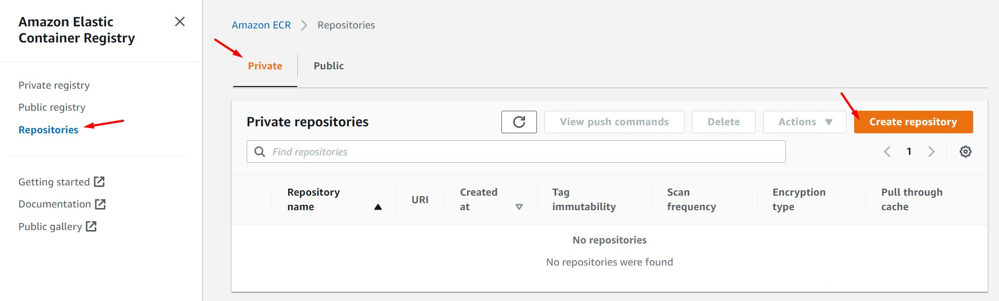

<br>

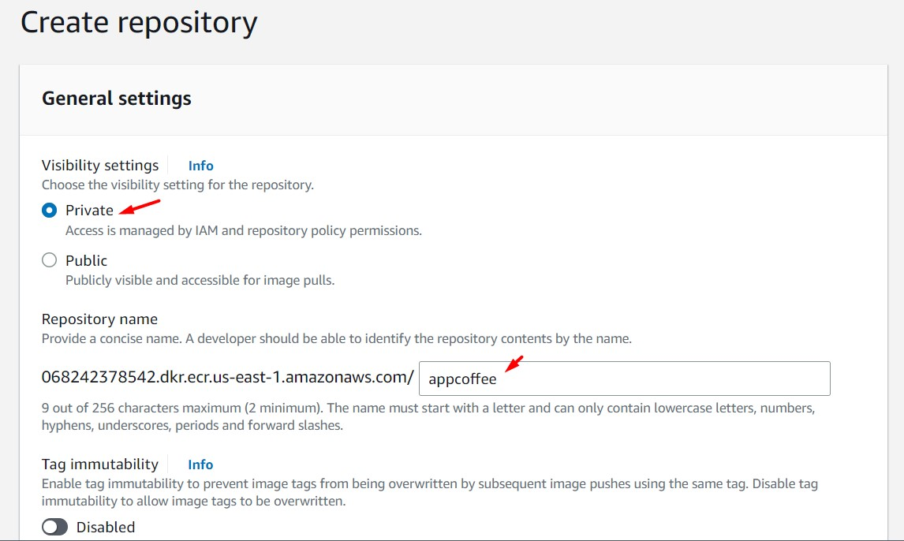

<br>

7. Ingresamos al repositorio privado previamente creado y damos clic en el botón "View push commands". Copiamos los comandos indicados y los ejecutamos desde Cloud9. Reemplazar el valor "XXXXXXXXXXXX" por el ID respectivo de nuestra cuenta. Validar que nuestra imagen se encuentra en el servicio ECR.

```bash
#Comando: Recuperar un token de autenticación y autenticar el cliente Docker en ECR
aws ecr get-login-password --region us-east-1 | docker login --username AWS --password-stdin XXXXXXXXXXXX.dkr.ecr.us-east-1.amazonaws.com

#Respuesta
WARNING! Your password will be stored unencrypted in /home/ubuntu/.docker/config.json.
Configure a credential helper to remove this warning. See
https://docs.docker.com/engine/reference/commandline/login/#credentials-store
Login Succeeded

#Comando - Identificar el nombre de nuestra imagen local
docker images
#Respuesta
REPOSITORY   TAG       IMAGE ID       CREATED             SIZE
app-coffee   latest    0083f471302b   About an hour ago   225MB
<none>       <none>    67a593657d07   About an hour ago   225MB
<none>       <none>    c2120eaa794e   About an hour ago   223MB
ubuntu       18.04     251b86c83674   5 days ago          63.1MB

#Comando: Etiquetar la imagen generada en el paso 5
docker tag app-coffee:latest XXXXXXXXXXXX.dkr.ecr.us-east-1.amazonaws.com/appcoffee:latest

#Comando - Identificar el nombre de nuestra nueva imagen
docker images
#Respuesta
REPOSITORY                                               TAG       IMAGE ID       CREATED             SIZE
XXXXXXXXXXXX.dkr.ecr.us-east-1.amazonaws.com/appcoffee   latest    0083f471302b   About an hour ago   225MB
app-coffee                                               latest    0083f471302b   About an hour ago   225MB
<none>                                                   <none>    67a593657d07   About an hour ago   225MB
<none>                                                   <none>    c2120eaa794e   About an hour ago   223MB
ubuntu                                                   18.04     251b86c83674   5 days ago          63.1MB

#Comando: 
docker push XXXXXXXXXXXX.dkr.ecr.us-east-1.amazonaws.com/appcoffee:latest

#Respuesta
The push refers to repository [XXXXXXXXXXXX.dkr.ecr.us-east-1.amazonaws.com/appcoffee]
5a4c71263e45: Pushed 
cf44208f9745: Pushed 
b0e0787c26b5: Pushed 
511cad7ce74e: Pushed 
45bbe3d22998: Pushed 
latest: digest: sha256:68ef8352d74c0f6715b14e3b9430dfcb5f529107ba222411c032aa990da4858a size: 1366
```

<br>

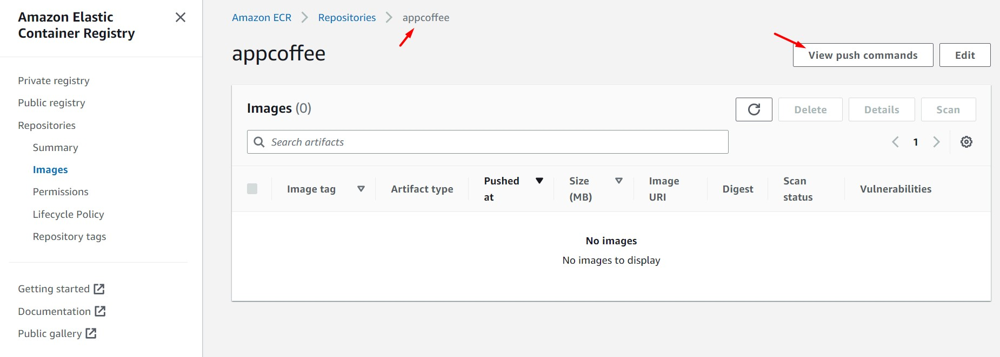

<br>

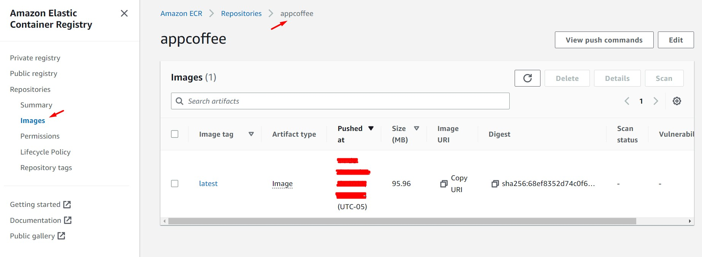

<br>

8. Accedemos al servicio ECS (Elastic Container Service) y damos clic en el botón "Create Cluster". Ingresamos/seleccionamos los siguientes valores. Luego, dar clic en el botón "Create".

    * **Cluster Configuration**
        * Cluster name: lab54
    * **Networking**
        * VPC: Seleccionamos vpc VPC
        * Subnets: Seleccionamos SUBNET PRIVATE AZ A y SUBNET PRIVATE AZ B
    * **Infraestructure**
        * Amazon EC2 Instances: On
        * Auto Scaling group (ASG): Create new AG
        * Operating system/Architecture: Amazon Linux 2
        * EC2 instance type: t2.micro
        * Desired capacity:
            * Minimum: 1
            * Maximum: 5
        * SSH Key pair: Seleccionar Key Pair

<br>

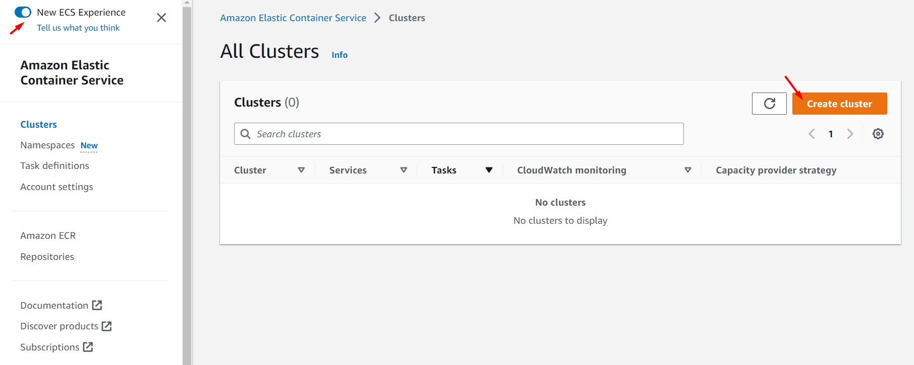

<br>

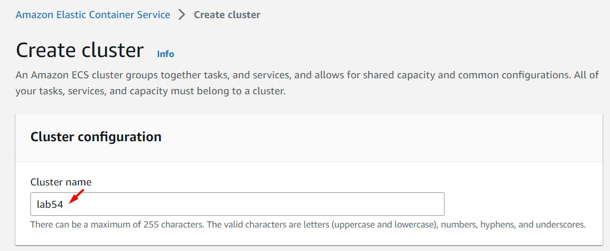

<br>

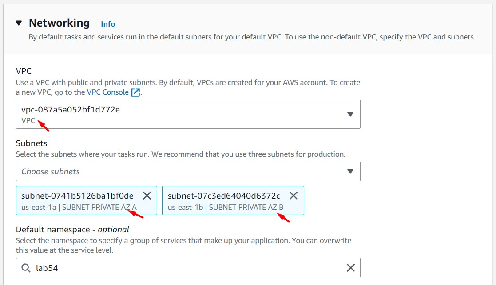

<br>

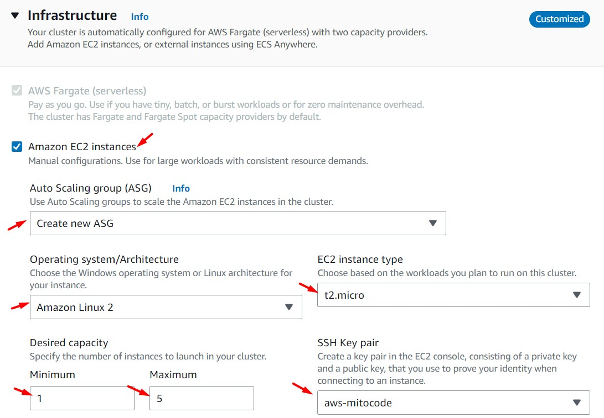

<br>

9. Desde el servicio "Secrets Manager" generamos el siguiente secreto. Dar clic en "Store a new secret". Luego dar clic en la opción "Other type of secret". Ingresar/seleccionar los siguientes valores, considerar los demás valores por defecto.

    * **Secret Type**
        * Other type of secret
    * **Key/value pairs**
        * Key: DATABASE_DNS
        * Value: "Ingresar el DNS Endpoint de nuestro RDS"
        * Encryption key: aws/secretsmanager
    * **Secret name and description**
        * Secret name: rds_secret

<br>

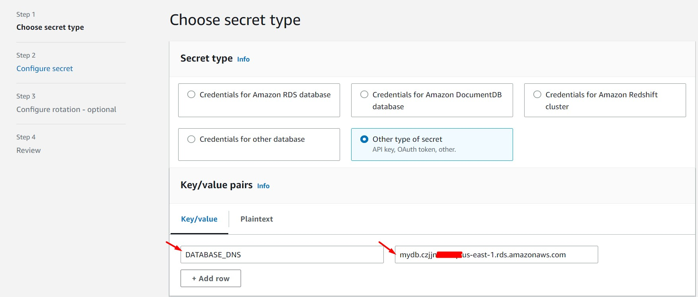

<br>

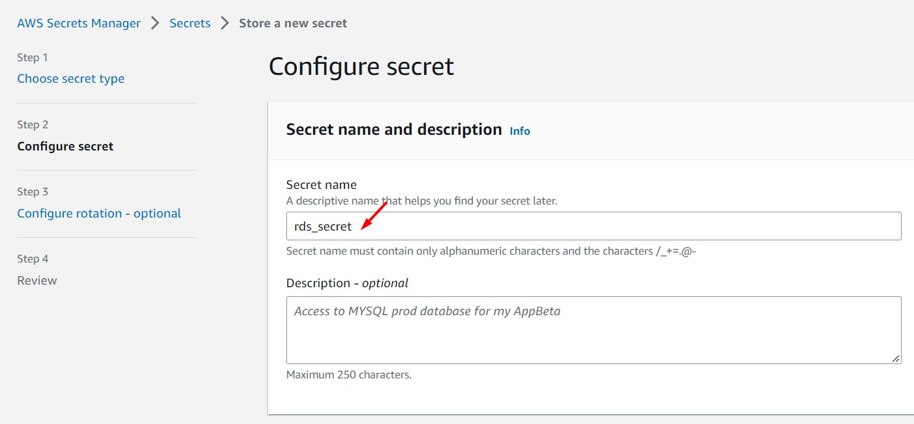

<br>

10. Acceder a nuestro secreto "rds_secret" y copiar el valor de "Secret ARN". Este valor será usado en pasos posteriores y se representará a través de la variable "SECRETS_MANAGER_ARN".

<br>

11. Acceder al servicio IAM y generar la siguiente política. Usar como valor del campo "Name" a "secrets_manager_ecs"

```bash
{
  "Version": "2012-10-17",
  "Statement": [
    {
      "Effect": "Allow",
      "Action": [
        "ssm:GetParameters",
        "secretsmanager:GetSecretValue"
      ],
      "Resource": [
        "${SECRETS_MANAGER_ARN}"
      ]
    }
  ]
}
```

12. Desde el servicio IAM, generar el siguiente rol. Este rol usará la siguiente relación de confianza para "ecs.tasks.amazonaws.com" y la política creada en el paso anterior. Además se asignará la siguiente política: "AmazonECSTaskExecutionRolePolicy"

    * Trusted entity type: Custom trust policy
    * Role name: secrets_manager_ecs
    * Policies:
        * secrets_manager_ecs
        * AmazonECSTaskExecutionRolePolicy

```bash
{
  "Version": "2012-10-17",
  "Statement": [
    {
      "Sid": "",
      "Effect": "Allow",
      "Principal": {
        "Service": "ecs-tasks.amazonaws.com"
      },
      "Action": "sts:AssumeRole"
    }
  ]
}
```

<br>

13. Generamos nuestro file System desde el servicio EFS a través del botón "Create File System"

    * Clic en el botón "Customize"

<br>

14. Desde la nueva ventana, seleccionar/ingresar los siguientes valores. Finalmente visualizaremos nuestro EFS aprovisionado.

    * **General**
        * Name: efs
        * Storage Class: Standard
        * Automatic backups: Disable automatic backups
        * Lifecycle Management: None
        * Encryption: Enable encryption of data at rest
    * **Performance settings**
        * Throughput mode: Bursting
        * Performance Mode: General Purpose
    * **Network**
        * VPC: Seleccionar VPC usada durante este laboratorio
        * Mount Targets:
            * us-east-1a: SUBNET PRIVATE AZ A - sg_efs
            * us-east-1b: SUBNET PRIVATE AZ B - sg_efs
    * File System Policy: Nothing

<br>

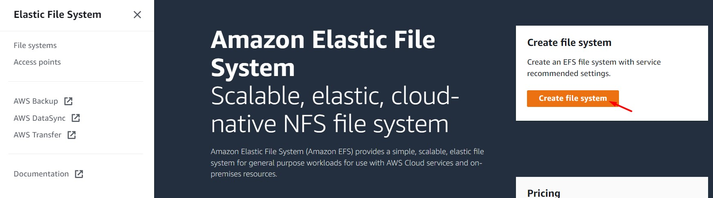

<br>


<br>

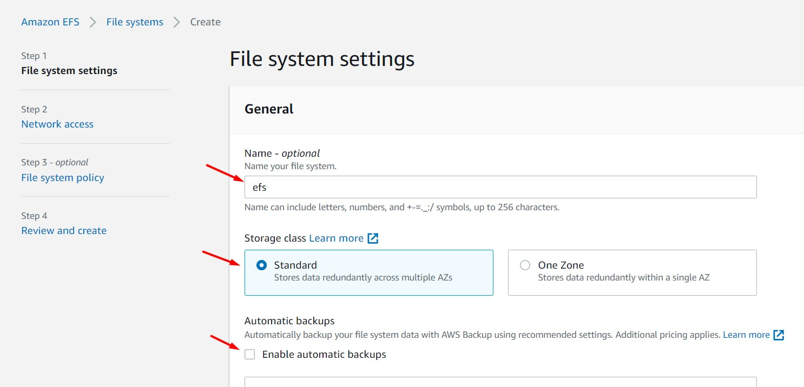

<br>

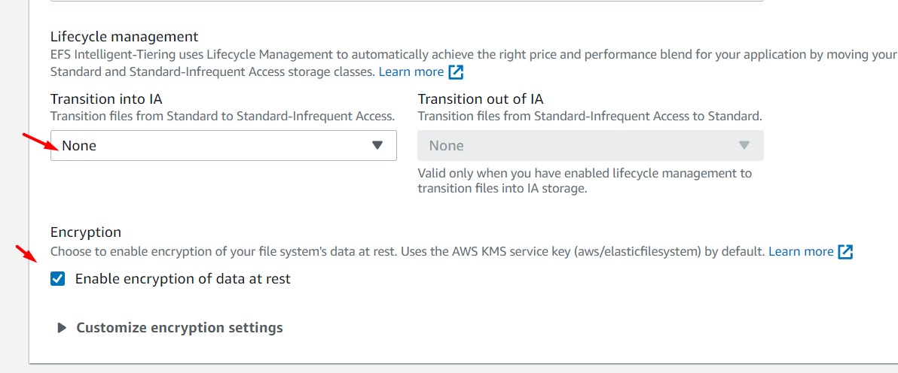

<br>

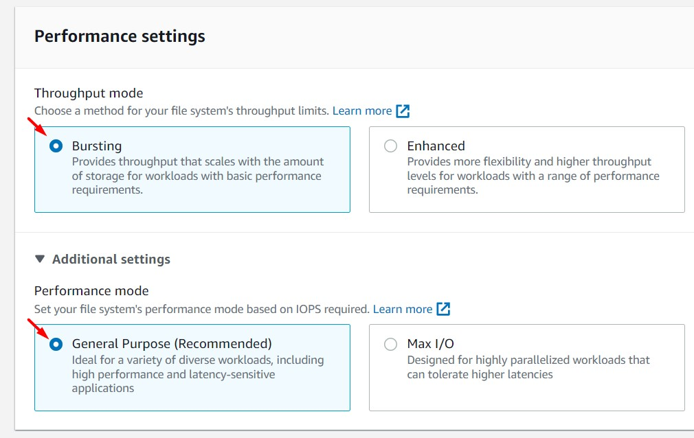

<br>

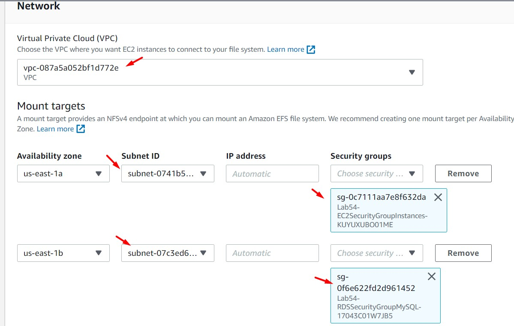

<br>

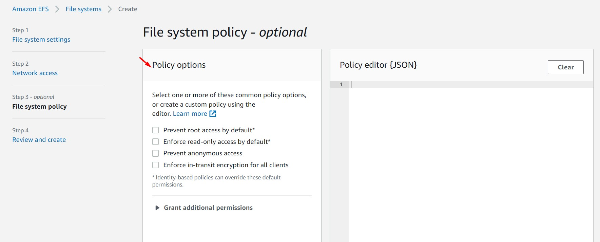

<br>

15. Accedemos al EFS aprovisionado e ingresamos a la sección "Access points". Luego, damos clic en el botón "Create access point". Ingresamos/seleccionamos las siguientes opciones. Finalizamos dando clic en el botón "Create access point"

    * Name: efs-root
    * Root directory path - optional: /

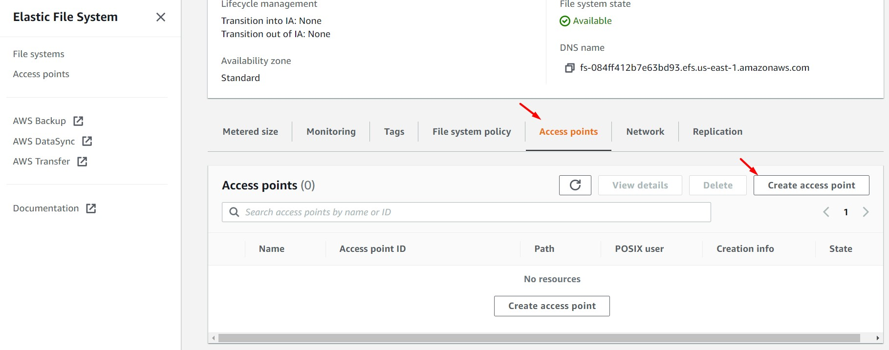

<br>

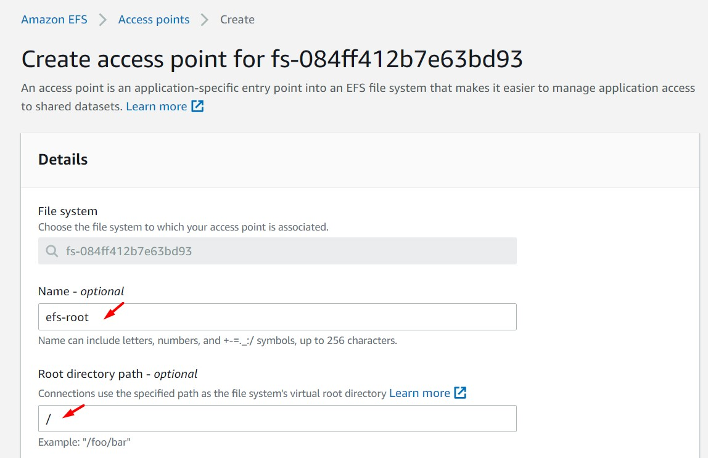

<br>

16. Desde la instancia "EC2 TOOL" montamos el EFS creado previamente. La plantilla cloudformation respectiva ha automatizada la instalación de los componetes que la distribución de Ubuntu necesita. 

```bash
#Comando - Mount EFS (Elastic File System)
REGION=$(curl -s http://169.254.169.254/latest/meta-data/placement/availability-zone | sed 's/\(.*\)[a-z]/\1/')
EFS=$(aws efs describe-file-systems --region $REGION | jq -r '.FileSystems[] | .FileSystemId')
echo "$EFS.efs.$REGION.amazonaws.com:/ /mnt/efs nfs4 defaults,_netdev 0 0" >> /etc/fstab
sudo mount -a
df -h

#Respuesta
Filesystem                                          Size  Used Avail Use% Mounted on
udev                                                473M     0  473M   0% /dev
tmpfs                                                98M  788K   97M   1% /run
/dev/xvda1                                          7.6G  2.1G  5.5G  28% /
tmpfs                                               488M     0  488M   0% /dev/shm
tmpfs                                               5.0M     0  5.0M   0% /run/lock
tmpfs                                               488M     0  488M   0% /sys/fs/cgroup
/dev/loop1                                           56M   56M     0 100% /snap/core18/2654
/dev/loop0                                           56M   56M     0 100% /snap/core18/2632
/dev/loop3                                           25M   25M     0 100% /snap/amazon-ssm-agent/6312
/dev/loop2                                           50M   50M     0 100% /snap/snapd/17883
/dev/xvda15                                         105M  4.4M  100M   5% /boot/efi
tmpfs                                                98M     0   98M   0% /run/user/0
fs-084ff412b7e63bd93.efs.us-east-1.amazonaws.com:/  8.0E     0  8.0E   0% /mnt/efs
```

<br>

### B - Creación de un cluster ECS-EC2 (Elastic Container Services) y uso de un task definition y services

<br>

17. Accedemos al servicio ECS, luego a la sección "Task definitions" y damos clic en el botón "Create a new task definition - Create a new task definition with JSON". Ingresamos el siguiente JSON, reemplazar las variables. Dar clic en "Create":

    * ACCOUNT_ID, número de 12 dígitos
    * ARN_SECRET_MANAGER, ARN (Amazon Resources Name) del secreto de base de datos almacenado en pasos anteriores
    * EFS_ID
    * EFS_ACCESS_POINT_ID 

<br>

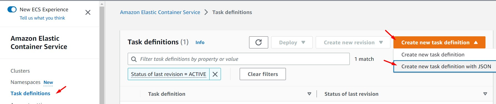

<br>

```bash
{
    "family": "app-coffee",
    "containerDefinitions": [
        {
            "name": "app-coffee",
            "image": "${ACCOUNT_ID}.dkr.ecr.us-east-1.amazonaws.com/appcoffee:latest",
            "cpu": 128,
            "memory": 128,
            "links": [],
            "portMappings": [
                {
                    "containerPort": 80,
                    "hostPort": 0,
                    "protocol": "tcp"
                }
            ],
            "essential": true,
            "entryPoint": [
                "/var/www/html/docker-entrypoint.sh"
            ],
            "command": [],
            "environment": [],
            "mountPoints": [
                {
                    "sourceVolume": "efs",
                    "containerPath": "/var/log/apache2/"
                }
            ],
            "volumesFrom": [],
            "secrets": [
                {
                    "name": "DATABASE_DNS",
                    "valueFrom": "${ARN_SECRET_MANAGER}:DATABASE_DNS::"
                }
            ],
            "dnsServers": [],
            "dnsSearchDomains": [],
            "dockerSecurityOptions": [],
            "logConfiguration": {
                "logDriver": "awslogs",
                "options": {
                    "awslogs-create-group": "true",
                    "awslogs-group": "/ecs/app-coffee",
                    "awslogs-region": "us-east-1",
                    "awslogs-stream-prefix": "ecs"
                }
            },
            "systemControls": []
        }
    ],
    "executionRoleArn": "arn:aws:iam::${ACCOUNT_ID}:role/secrets_manager_ecs",
    "networkMode": "bridge",
    "volumes": [
        {
            "name": "efs",
            "efsVolumeConfiguration": {
                "fileSystemId": "${EFS_ID}",
                "rootDirectory": "/",
                "transitEncryption": "ENABLED",
                "authorizationConfig": {
                    "accessPointId": "${EFS_ACCESS_POINT_ID}",
                    "iam": "DISABLED"
                }
            }
        }
    ],
    "requiresCompatibilities": [
        "EC2"
    ],
    "cpu": "128",
    "memory": "128",
    "runtimePlatform": {
        "cpuArchitecture": "X86_64",
        "operatingSystemFamily": "LINUX"
    },
    "tags": [
        {
            "key": "ecs:taskDefinition:createdFrom",
            "value": "ecs-console-v2"
        }
    ]
}
```

<br>

18. Desde el Task Definition creado, dar clic en el botón "Deploy" y luego dar clic en "Create a Service". Seleccionar/ingresar las siguientes opciones. Finalmente dar clic en el botón "Create"

    * **Environment**
        * Existing cluster: lab54
        * Compute options: Launch Type
        * Launch type: EC2
    * **Deployment configuration**
        * Application type: Services
        * Service name: app-coffee
        * Service type: Replica
        * Desired tasks: 1
    * **Load balancing - optional**
        * Load balancer type: Application Load Balancer
        * Application Load Balancer: Use an existing load balancer
        * Load balancer: EC2ApplicationLoadBalancer
        * Choose container to load balance: app-coffee 80:80
        * Listener: Use an existing listener
        * Listener: 80:HTTP
        * Target Group: Use an existing target group
        * Target Group name: EC2LoadBalancerTargetGroupApp
        * Health check grace period: 10

<br>

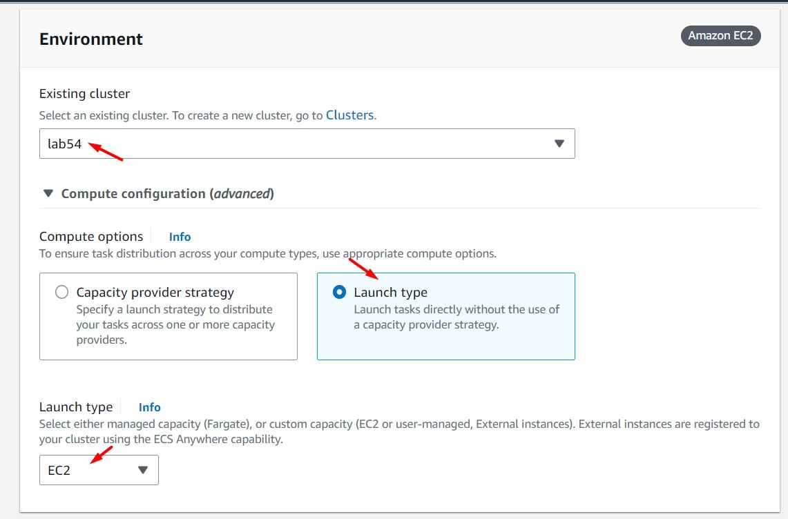

<br>

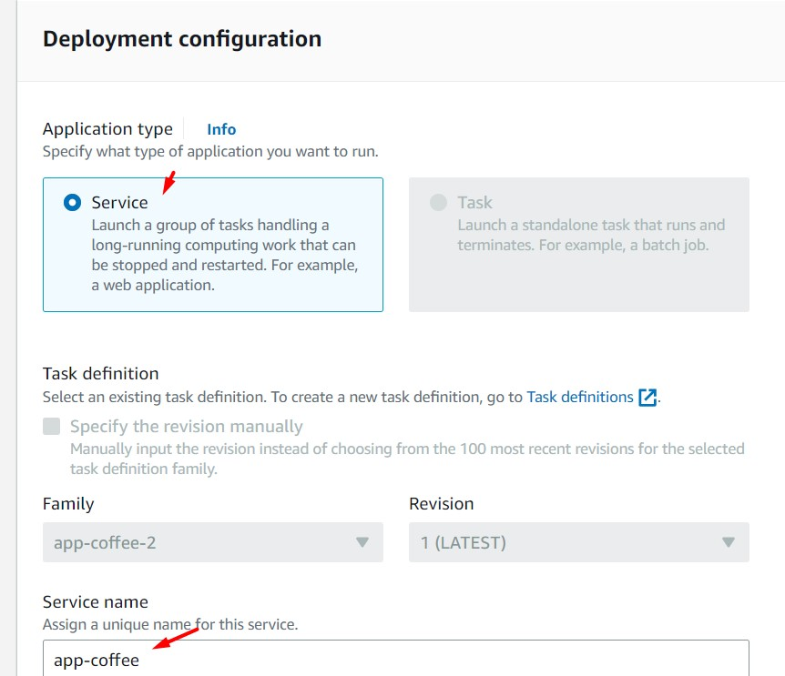

<br>

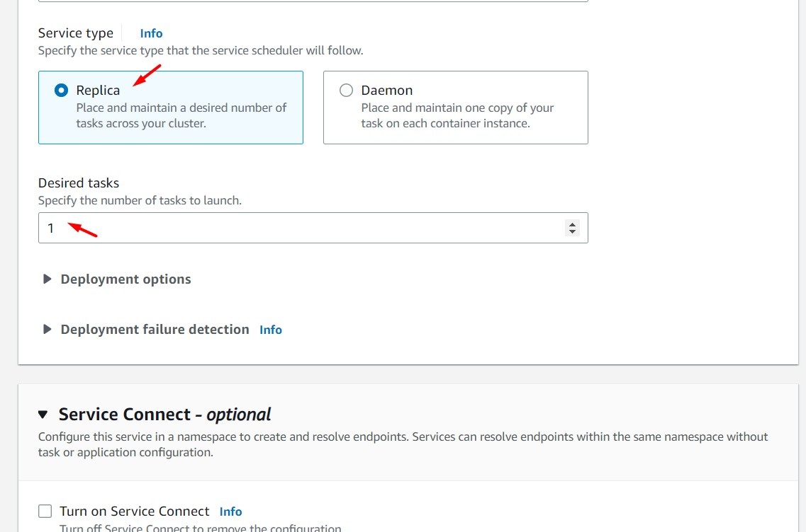

<br>

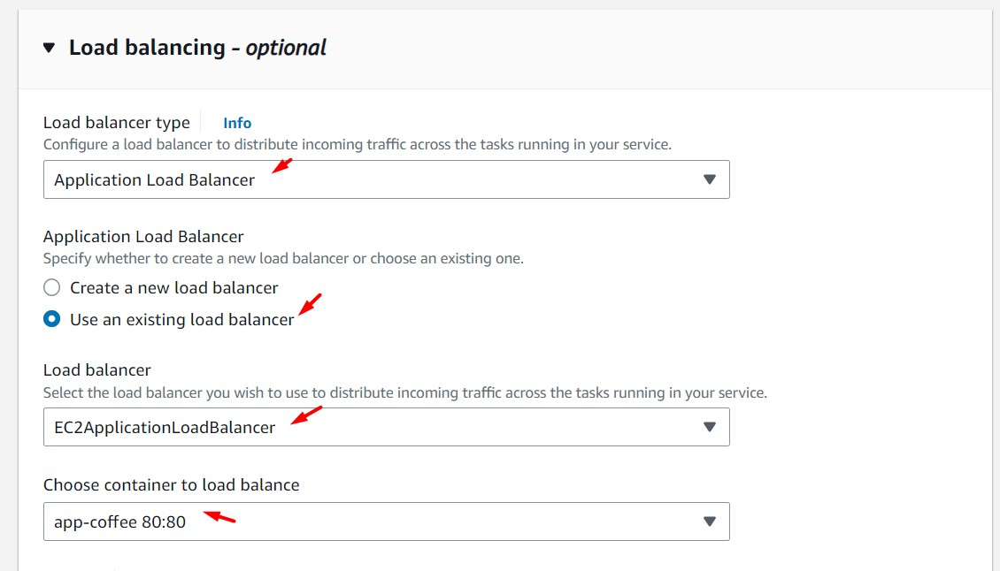

<br>

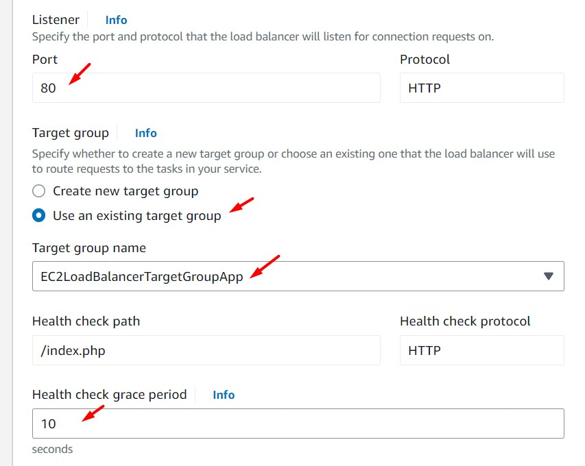

<br>

19. Acceder al DNS del balanceador de aplicaciones y validar que la aplicación está ejecutándose. Acceder a los botones "Home" y "Coffee". La opción "Coffee" permite la conexión a la base de datos RDS.

<br>


<br>

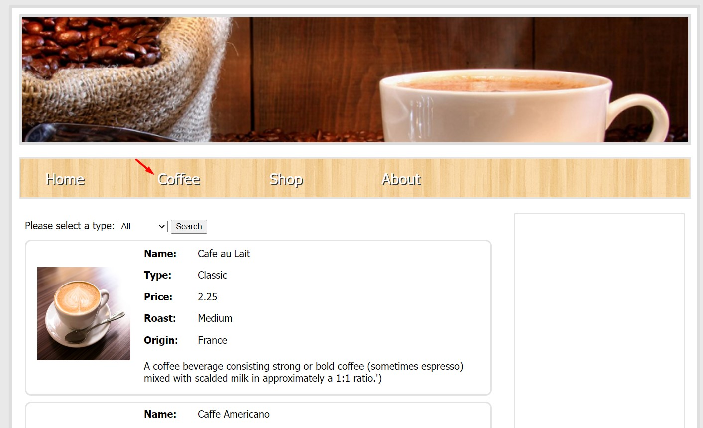

<br>

20. Acceder a la instancia "EC2 TOOL" y revisar el contenido de la carpeta /mnt/efs. Se deberá visualizar los archivos "access.log", "error.log" y "other_vhosts_access.log".

```bash
#Comando
ls /mnt/efs

#Resultado
access.log  error.log  other_vhosts_access.log

#Comando
tail -f /mnt/efs/access.log

#Resultado
192.168.1.64 - - [XX/XXX/XXXX18:20:48 -0500] "GET /index.php HTTP/1.1" 200 1423 "-" "ELB-HealthChecker/2.0"
192.168.2.35 - - [XX/XXX/XXXX:18:20:48 -0500] "GET /index.php HTTP/1.1" 200 1423 "-" "ELB-HealthChecker/2.0"
192.168.1.64 - - [XX/XXX/XXXX:18:20:53 -0500] "GET /index.php HTTP/1.1" 200 1423 "-" "ELB-HealthChecker/2.0"
192.168.2.35 - - [XX/XXX/XXXX:18:20:53 -0500] "GET /index.php HTTP/1.1" 200 1423 "-" "ELB-HealthChecker/2.0"
192.168.1.64 - - [XX/XXX/XXXX:18:20:58 -0500] "GET /index.php HTTP/1.1" 200 1423 "-" "ELB-HealthChecker/2.0"
192.168.2.35 - - [XX/XXX/XXXX:18:20:58 -0500] "GET /index.php HTTP/1.1" 200 1423 "-" "ELB-HealthChecker/2.0"
192.168.1.64 - - [XX/XXX/XXXX:18:21:03 -0500] "GET /index.php HTTP/1.1" 200 1423 "-" "ELB-HealthChecker/2.0"
192.168.2.35 - - [XX/XXX/XXXX:18:21:03 -0500] "GET /index.php HTTP/1.1" 200 1423 "-" "ELB-HealthChecker/2.0"
192.168.1.64 - - [XX/XXX/XXXX:18:21:08 -0500] "GET /index.php HTTP/1.1" 200 1423 "-" "ELB-HealthChecker/2.0"
192.168.2.35 - - [XX/XXX/XXXX:18:21:08 -0500] "GET /index.php HTTP/1.1" 200 1423 "-" "ELB-HealthChecker/2.0"
```

<br>

21. Desde la instancia "EC2 TOOL" acceder al Cluster ECS-EC2. Se deberá agregar permisos al security group de la instancia ECS-EC2 para poder acceder. Considerar que la llave key.pem deberá ser importado a esta instancia. Desde el cluster ECS-EC2 realizar las siguientes validaciones

```bash
#Comando Docker
docker ps

#Resultado
CONTAINER ID   IMAGE                                                           COMMAND                  CREATED          STATUS                 PORTS                             NAMES
77bc639f86af   XXXXXXXXXXXX.dkr.ecr.us-east-1.amazonaws.com/appcoffee:latest   "/var/www/html/docke…"   42 minutes ago   Up 42 minutes          0.0.0.0:49159->80/tcp, :::49159->80/tcp   ecs-app-coffee-1-app-coffee-e6fec98cebd8e9d2f601
28f676c84322   amazon/amazon-ecs-agent:latest                                  "/agent"                 5 hours ago      Up 5 hours (healthy)                             ecs-agent

#Comando
#Copiar el CONTAINER ID del recurso que hace referencia a "appcoffee"
docker exec -ti ${CONTAINER_ID} bash

#Dentro del contenedor acceder a la carpeta de la aplicación y realizar las validaciones necesarias
cd /var/www/html/

#Resultado
root@77bc639f86af:/var/www/html# ls
Coffee.php  Controller  Dockerfile  Entities  Images  Model  Styles  Template.php  docker-entrypoint.sh  index.html  index.php  nbproject
root@77bc639f86af:/var/www/html#
```

<br>

22. Desde el serviico ECS, ingresar a "Cluster" y accedemos a nuestro cluster. Luego, ingresamos a la pestaña "Services" y damos clic en el botón "Update". Modificar el valor "Desired tasks" a 4. Dar clic en el botón "Update"

<br>

23. Desde la instancia "EC2 TOOL" conectada al cluster "ECS-EC2" ejecutar el siguiente comando y analizar la respuesta. Asimismo analizar el cluster desplegado desde la consola de ECS, así como el ALB y el servicio de CloudFormation

```bash
#Comando
docker ps

#Resultado
CONTAINER ID   IMAGE                                                           COMMAND                  CREATED          STATUS                    PORTS                                NAMES
c305b3498a9f   068242378542.dkr.ecr.us-east-1.amazonaws.com/appcoffee:latest   "/var/www/html/docke…"   29 seconds ago   Up 25 seconds             0.0.0.0:49158->80/tcp, :::49158->80/tcp   ecs-app-coffee-20-app-coffee-98bb8f979bbcfddd9a01
3fefee432f4d   068242378542.dkr.ecr.us-east-1.amazonaws.com/appcoffee:latest   "/var/www/html/docke…"   29 seconds ago   Up 25 seconds             0.0.0.0:49157->80/tcp, :::49157->80/tcp   ecs-app-coffee-20-app-coffee-8cc7df83c2e5f289d801
1f900bd7d7ee   068242378542.dkr.ecr.us-east-1.amazonaws.com/appcoffee:latest   "/var/www/html/docke…"   29 seconds ago   Up 25 seconds             0.0.0.0:49156->80/tcp, :::49156->80/tcp   ecs-app-coffee-20-app-coffee-e6f8ed91e49eeba92300
cd69380d9d54   068242378542.dkr.ecr.us-east-1.amazonaws.com/appcoffee:latest   "/var/www/html/docke…"   30 seconds ago   Up 26 seconds             0.0.0.0:49155->80/tcp, :::49155->80/tcp   ecs-app-coffee-20-app-coffee-d0bbeeb8c79ecfa19601
39cd7f679ac4   068242378542.dkr.ecr.us-east-1.amazonaws.com/appcoffee:latest   "/var/www/html/docke…"   3 minutes ago    Up 3 minutes              0.0.0.0:49154->80/tcp, :::49154->80/tcp   ecs-app-coffee-19-app-coffee-8ea597f48b868bf8ee01
08c65960ab75   amazon/amazon-ecs-agent:lat
```


---

### Eliminar los siguientes recursos

* Desde ECS-Cluster, opción "Services", eliminar el servicio
* Desde ECS-Cluster, opción "Task", hacer "stop" a las tareas
* Desde ECS, "Deregister" las versiones del Task Definition generados
* Eliminar el cluster ECS
* Eliminar repositorio ECR
* Eliminar plantilla de CloudFormation "lab54-vpc-alb-rds"
* Eliminar instancia Cloud9
* Eliminar desde IAM, el rol "secrets_manager_ecs"
* Eliminar desde IAM, la política "secrets_manager_ecs"
* Eliminar EFS
* Eliminar Secrets Manager, configurar "Waiting period" en 7 días