# AWS Solutions Architect Associate - Laboratorio 55

<br>

### Objetivo: 
* Accesos de usuarios IAM a determinados buckets S3 usando Custom IAM Policies 

### Tópico:
* Security, Identity and Compliance

### Dependencias:
* Ninguna

### Referencia:
* Lab13 - https://github.com/jbarreto7991/aws-cloudpractitioner/blob/main/Lab-13/README-Lab13.md

<br>

---

### A - Accesos de usuarios IAM a determinados buckets S3 usando Custom IAM Policies 

<br>

1. Ingresar al servicio S3, el siguiente proceso se deberá repetir dos veces debido a que se busca crear dos buckets S3. 

<br>

2. Dar clic en "Create bucket". Ingresar un nombre aleatorio (p.ej. "aws-cloudpractitioner-lab13-01" y "aws-cloudpractitioner-lab13-02") y dar clic en el botón "Create bucket". Los nombres de los buckets S3 son únicos a nivel global. 


<br>

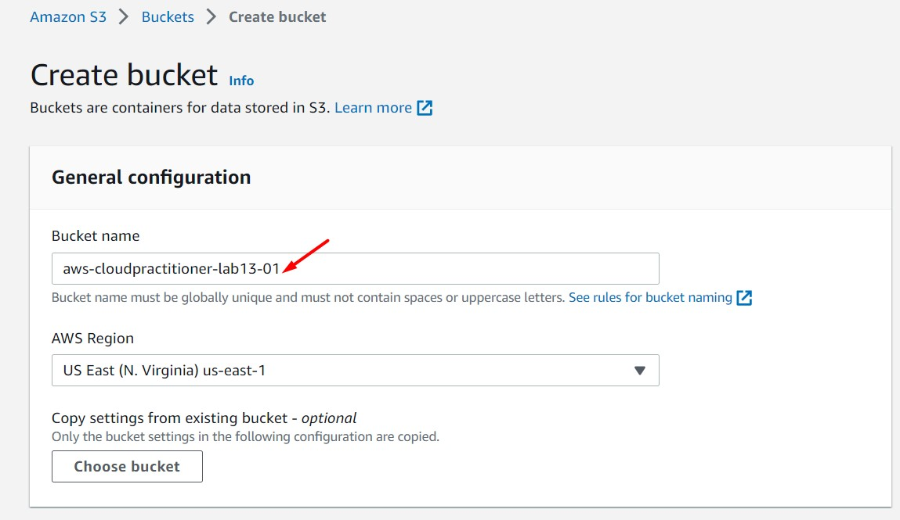
<br>

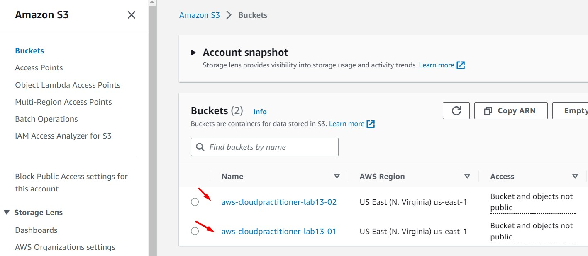
<br>

3. Ingresar al servicio IAM y crear dos políticas IAM. Los siguientes pasos (4, 5 y 6) describen la creación de una política, repetir los pasos y realizar las personalizaciones necesarios para tener dos políticas IAM. Dar clic en "Create Policy" 

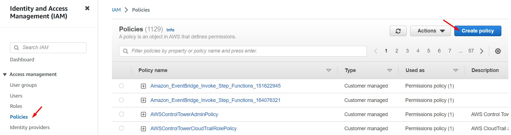
<br>

4. Acceder a la pestaña JSON y pegar la siguiente política. Reemplazar la variable $NOMBRE_BUCKET por el nombre de nuestro bucket creados en el paso 2. 

```bash
#Plantilla
{
    "Version": "2012-10-17",
    "Statement": [
        {
            "Effect": "Allow",
            "Action": [
                "s3:GetObject",
                "s3:PutObject"
            ],
            "Resource": [
                "arn:aws:s3:::$NOMBRE_BUCKET",
                "arn:aws:s3:::$NOMBRE_BUCKET/*"
            ]
        },
        {
            "Effect": "Allow",
            "Action": [
                "s3:ListAllMyBuckets"
            ],
            "Resource": "*"
        }
    ]
}
```

```bash
#Ejemplo
{
    "Version": "2012-10-17",
    "Statement": [
        {
            "Effect": "Allow",
            "Action": [
                "s3:GetObject",
                "s3:PutObject"
            ],
            "Resource": [
                "arn:aws:s3:::aws-cloudpractitioner-lab13-01",
                "arn:aws:s3:::aws-cloudpractitioner-lab13-01/*"
            ]
        },
        {
            "Effect": "Allow",
            "Action": [
                "s3:ListAllMyBuckets"
            ],
            "Resource": "*"
        }
    ]
}
```

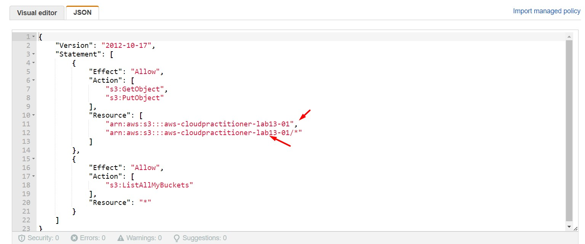
<br>

5. Dar clic en "Next: Review", ingresar un nombre a nuestra política (p.ej. "aws-cloudpractitioner-lab13-01" y "aws-cloudpractitioner-lab13-02") y dar clic en "Create policy"

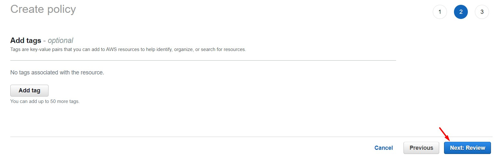
<br>

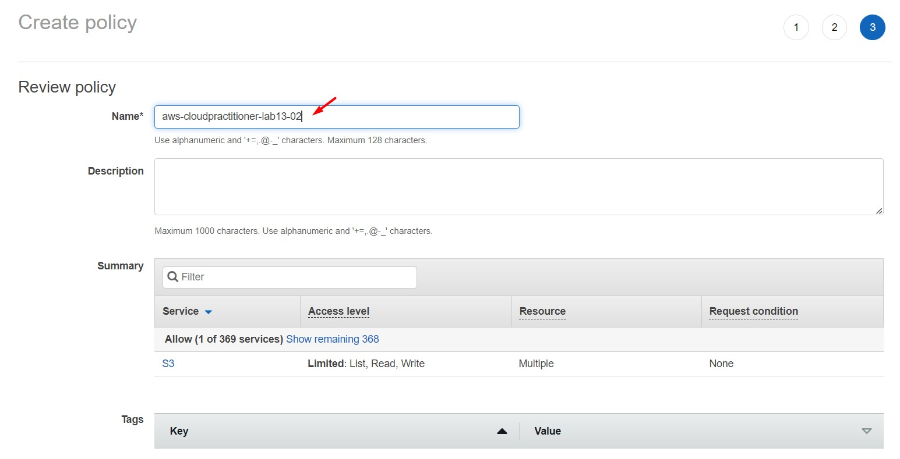
<br>

6. Finalizado los pasos anteriores deberemos tener dos IAM Policies de nombre "aws-cloudpractitioner-lab13-01" y "aws-cloudpractitioner-lab13-01"

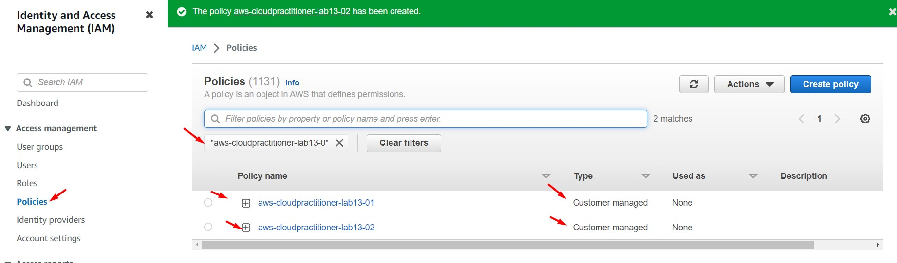
<br>

7. Ingresar al servicio IAM y crear dos usuarios IAM de consola. Ingresar o seleccionar los siguientes valores. Dar clic en "Next"

    * User details
        * User name: aws-cloudpractitioner-lab13-01 y aws-cloudpractitioner-lab13-02
        * Provide user access to the AWS Management Console - optional: Enable
        * Are you providing console access to a person?: I want to create an IAM user
        * Console password
            * Custom password: 123456-Aa
        * Users must create a new password at next sign-in (recommended): Disable

<br>
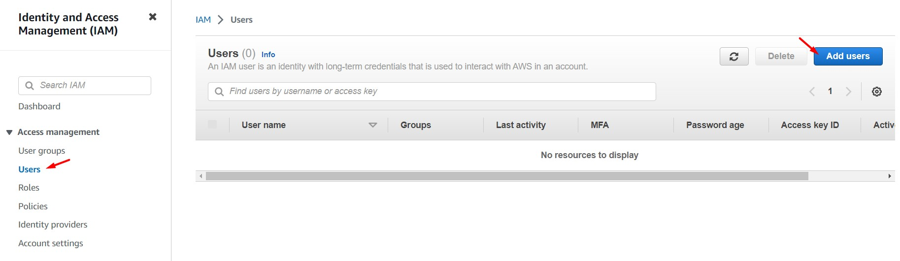
<br>

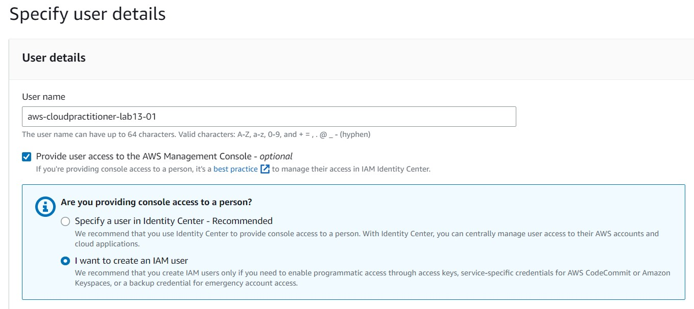
<br>

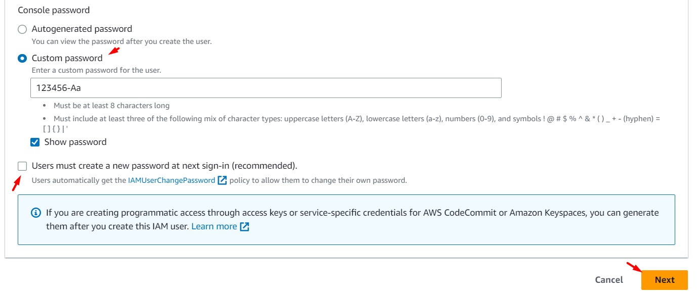
<br>

8. En la sección "Set permissions", seleccionar "Attach policies directly" y buscar la política "aws-cloudpractitioner-lab13-01". Seleccionar la política en mención y dar clic en "Next". Luego, dar clic en "Create User"

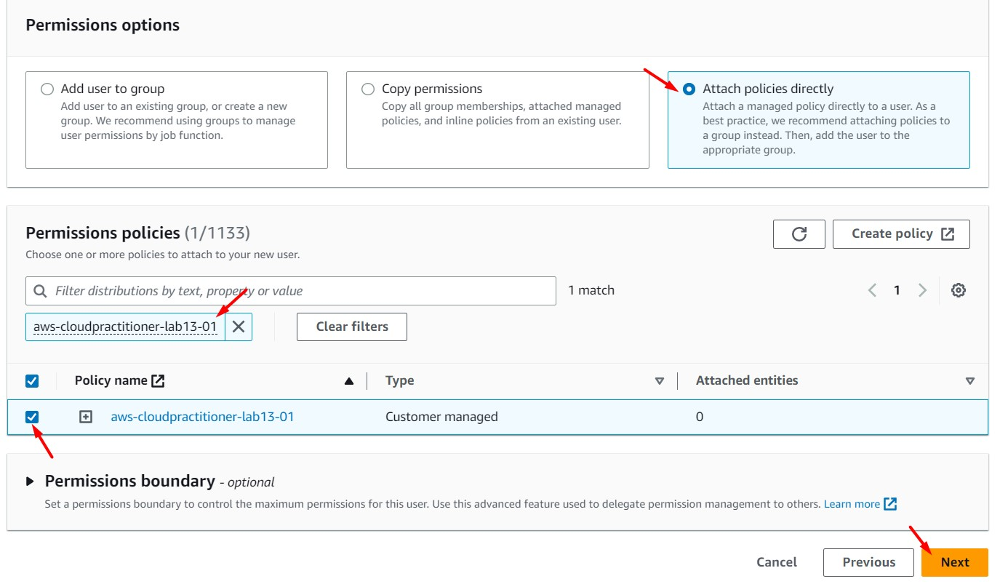
<br>

9. Copiar los valores que se muestran a continuación (Console sign-in URL, User name, Console password). Repetir los pasos 7, 8 y 9 para la creación del segundo usuario IAM ("aws-cloudpractitioner-lab13-02")

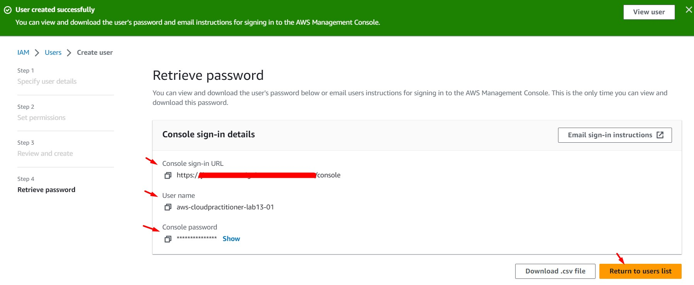
<br>

10. Los pasos desarrollados anteriormente, nos da como resultado los siguientes recursos creados

    * 01 IAM usuario "aws-cloudpractitioner-lab13-01" que tiene asociada la IAM Policy "aws-cloudpractitioner-lab13-01" y el cual tendrá acceso al bucket S3 "aws-cloudpractitioner-lab13-01"
    * 01 IAM usuario "aws-cloudpractitioner-lab13-02" que tiene asociada la IAM Policy "aws-cloudpractitioner-lab13-02" y el cual tendrá acceso al bucket S3 "aws-cloudpractitioner-lab13-02"

<br>

11. Nos loguearemos con cada IAM User y accederemos con cada uno de ellos a ambos buckets S3. Para loguearnos considerar los campos "Console sign-in URL", "User name", "Console password" obtenidos en el paso 9. Las imagenes detalladas a continuación corresponden al usuario "aws-cloudpractitioner-lab13-01", este usuario puede acceder al bucket "aws-cloudpractitioner-lab13-01", pero no al bucket "aws-cloudpractitioner-lab13-02".

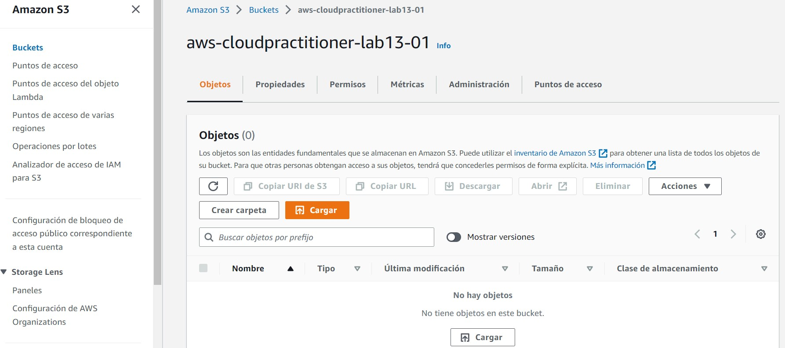
<br>

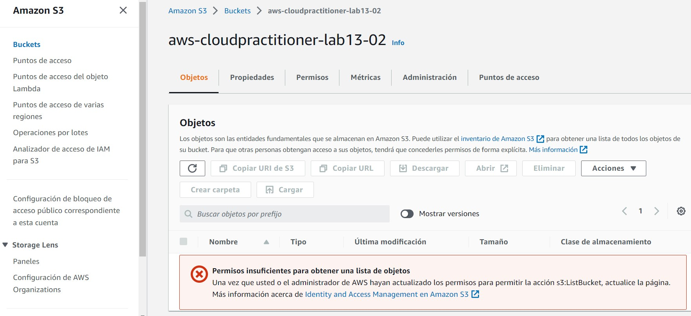
<br>


---

### Eliminación de recursos creados
<br>

1. Eliminar 02 S3 Buckets
2. Elminar 02 IAM Policies
3. Eliminar 02 IAM User