# AWS Solutions Architect Associate - Laboratorio 56

<br>

### Objetivo: 
* Aprovisionamiento de una instancia RDS Aurora usando Secrets Manager como generador de credenciales

### Tópico:
* Database
* Security, Identity & Compliance

### Dependencias:
* Implementación del Laboratorio 33 ("1_lab33-vpc.yaml" y "3_lab33-ec2-s3.yaml")

### Costo:
* El uso de "RDS Aurora" no está dentro de la capa gratutita debido a que los tipos de instancias a usar no se encuentran dentro de la capa gratuita. En este laboratorio se hará uso de la instancia "db.t3.small" (MySQL). Precio por hora 0,041 USD. 

<br>


---

### A - Aprovisionamiento de una instancia RDS Aurora usando Secrets Manager como generador de credenciales

<br>

1. Accedemos al servicio RDS y damos clic en la opción "Create database"

<br>

2. Ingresamos/seleccionamos los siguientes valores:

    * Choose a database creation method: Standard create
    * Engine options: Aurora (MySQL Compatible)
    * Templates: Dev/Test
    * Settings:
        * DB cluster identifier: aurora
        * Credentials Settings
            * Master username: administrator
            * Manage master credentials in AWS Secrets Manager: Enabled
            * Select the encryption key: aws/secretsmanager (default)
    * Instance configuration:
        * DB instance class: Burstable classes (includes t classes)
            * t3.small
    * Availability & durability
        * Multi-AZ deployment: Don't create an Aurora Replica
    * Connectivity
        * Compute resource: Connect to an EC2 compute resource
            * EC2 instance: Seleccionar "EC2 BACKEND" (opción desplegada en el Lab33)
        * DB subnet group: Choose existing
            * Existing DB subnet groups: Seleccionar "rds-subnet-group" (opción desplegada en el Lab33)
        * Public access: No
        * VPC security group (firewall): Choose existing
            * Additional VPC security group: lab33-secret-manager-rds (opción desplegada en el Lab33)
    * Database authentication
        * Database authentication options: Password authentication
    * Monitoring
        * Enable Enhanced monitoring: Disabled

<br>

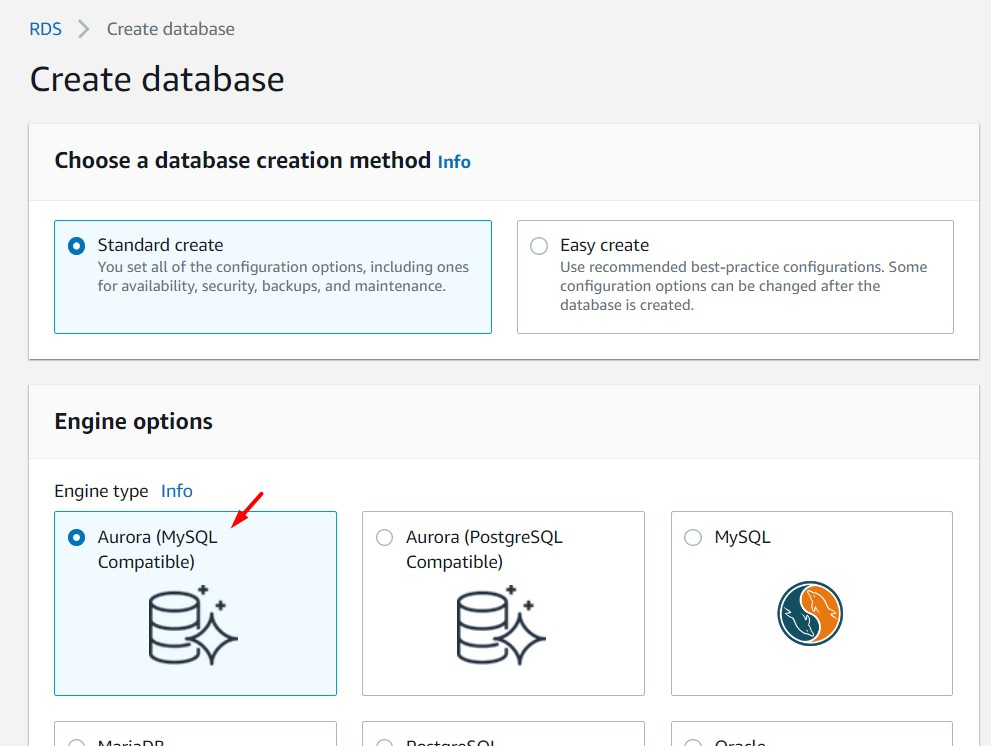

<br>

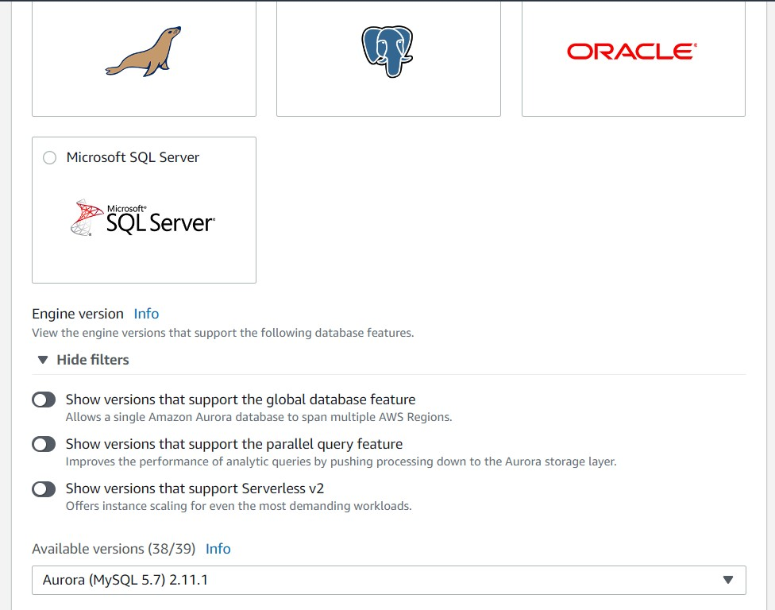

<br>

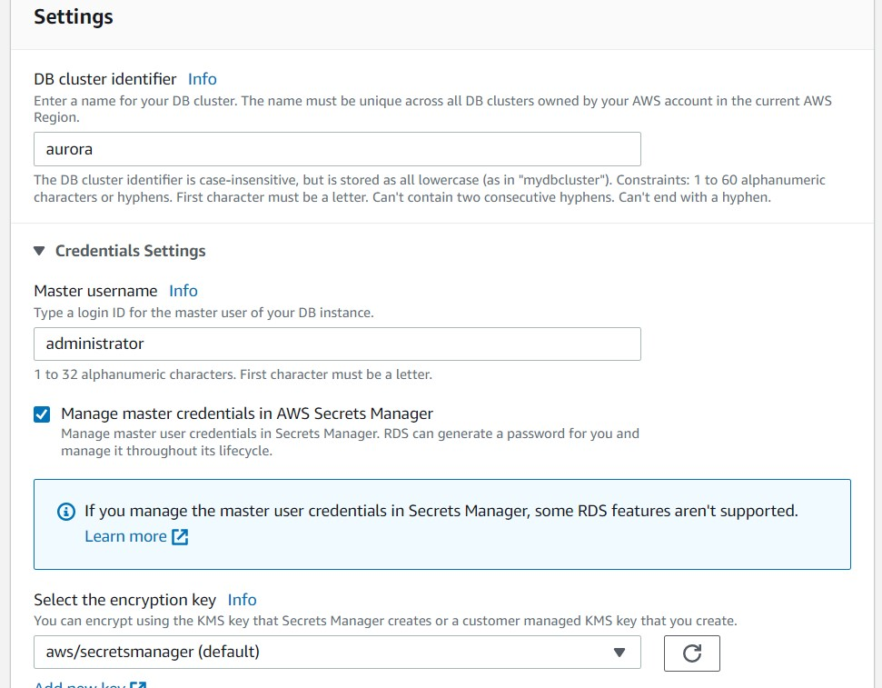

<br>

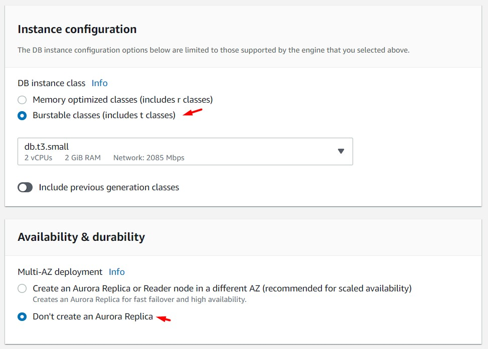

<br>

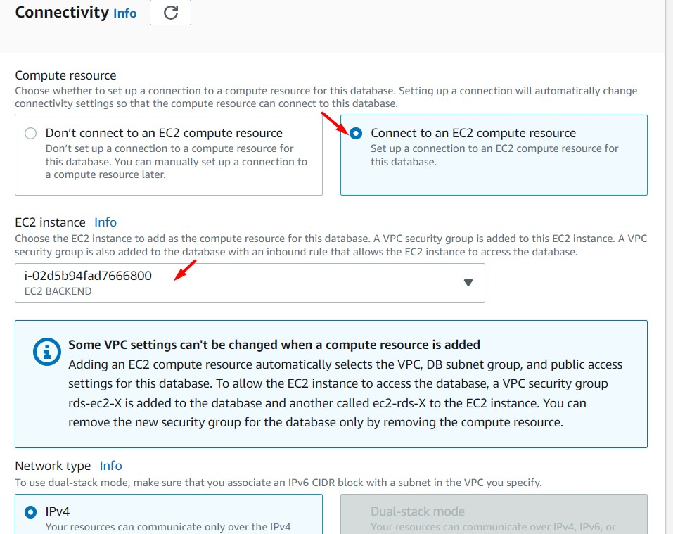

<br>

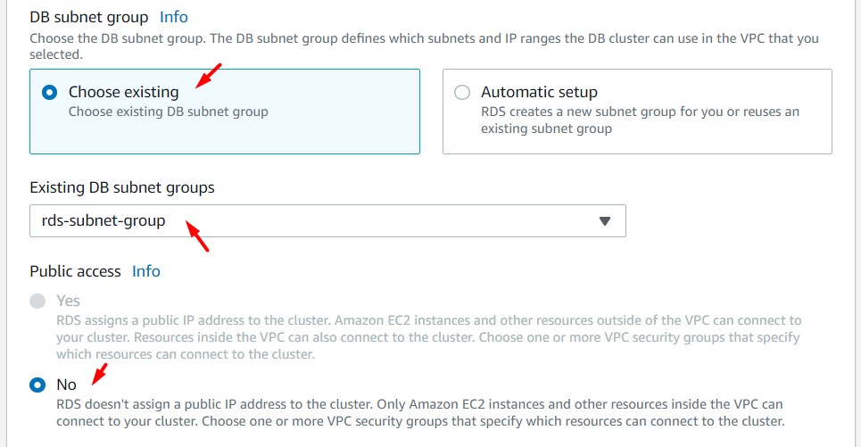

<br>

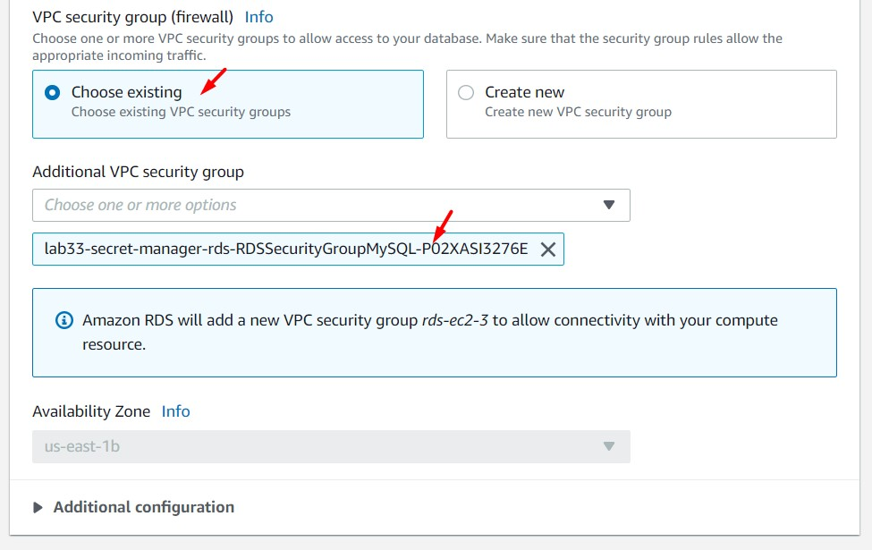

<br>

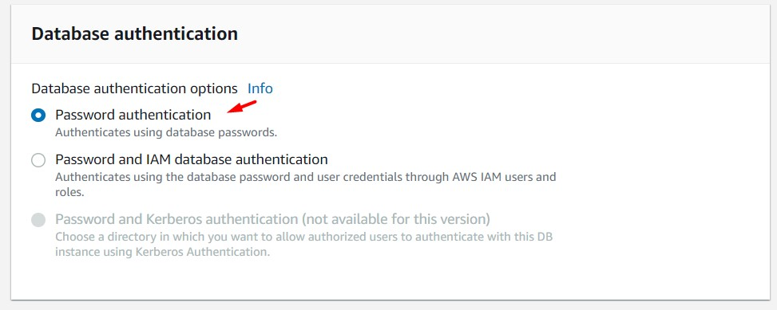

<br>

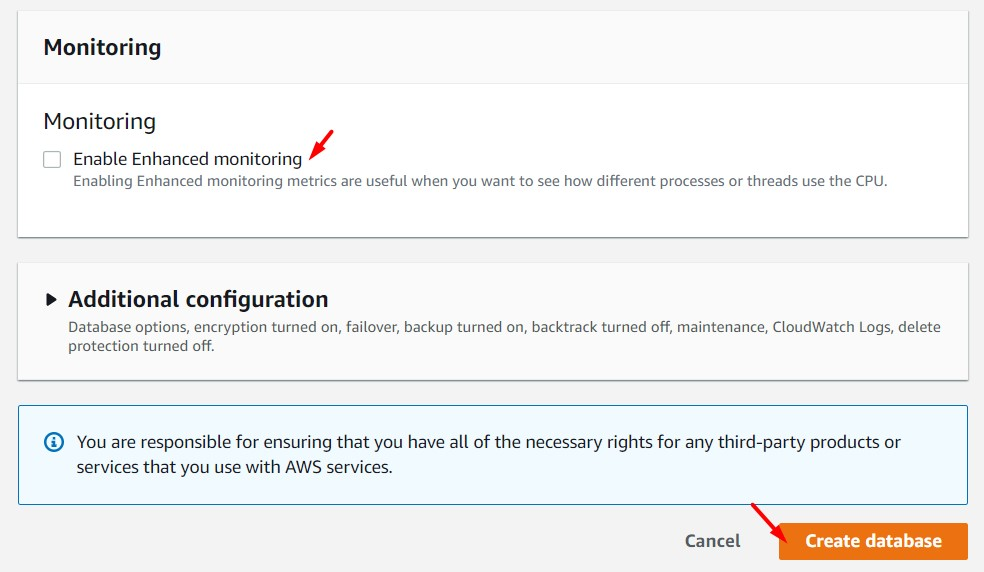

<br>

3. Esperamos unos minutos mientras la base de datos RDS Aurora (MySQL) se aprovisiona

<br>

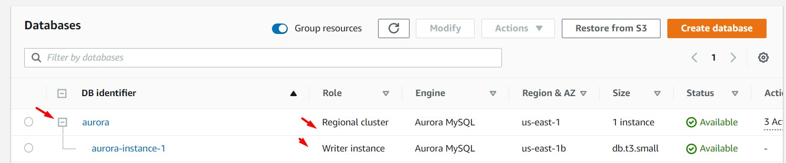

<br>

4. Accedemos al Cluster de Aurora y en la sección "Connectivity & Security" identificaremos 02 Endpoints ("Writer instance" y "Reader instance"). Copiamos el valor de "Writer instance"

    * Writer instance: aurora.cluster-czjjnxzr0ilp.us-east-1.rds.amazonaws.com
    * Reader instance: aurora.cluster-ro-czjjnxzr0ilp.us-east-1.rds.amazonaws.com


<br>

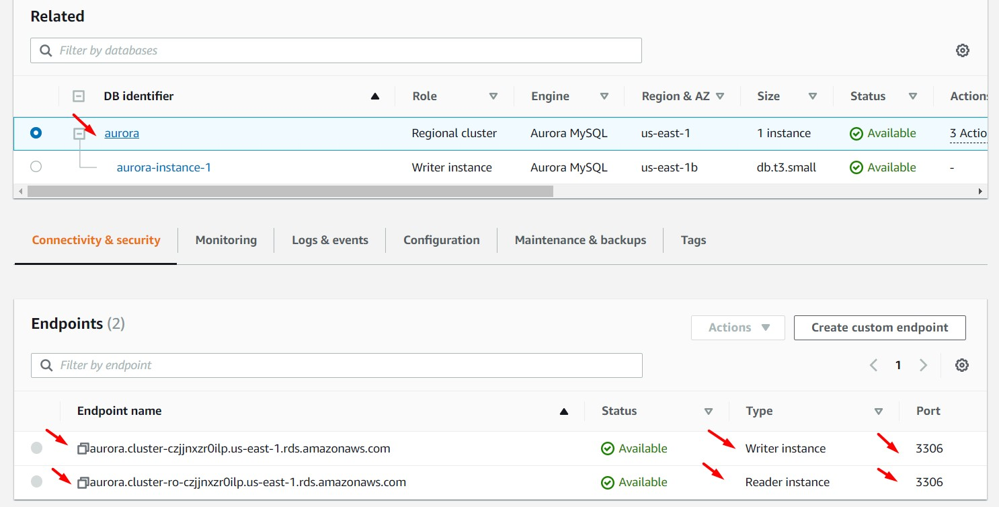

<br>

5. Accedemos al servicio "Secrets Manager" y visualizaremos el "Secret name" generado por RDS Aurora. Accedemos al mismo e identificamos la sección "Secret value". Dar clic en "Retrieve secret value". Obtenemos los valores "username" y "password".


<br>

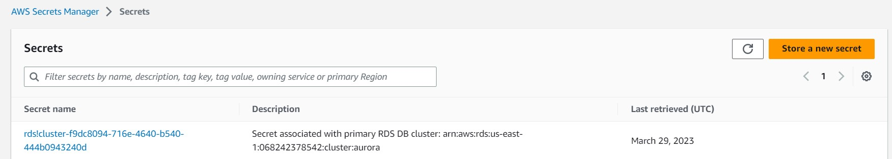

<br>

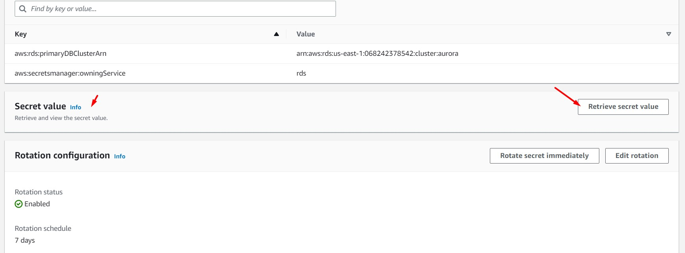

<br>


<br>

6. Ingresamos a nuestra instancia EC2 "EC2 BACKEND" y modificamos el archivo .env con el objetivo de agregar el endpoint Writer de RDS Aurora. Reemplazamos el valor de "DB_URI" (valor obtenido desde RDS), "DB_PASSWORD" (Valor obtenido desde Secrets Manager) y reiniciamos el servicio. 

```bash
nano /opt/aws-solutionsarchitectassociate/App/backend/.env
#Reemplazar Endpoint RDS Read Replica obtenido en el paso anterior en la variable "DB_URI"
cd /opt/aws-solutionsarchitectassociate/App/backend/
sudo lsof -t -i:80
#El comando anterior resolverá un ID
kill -9 $ID
sudo lsof -t -i:80
npm start &
```

<br>

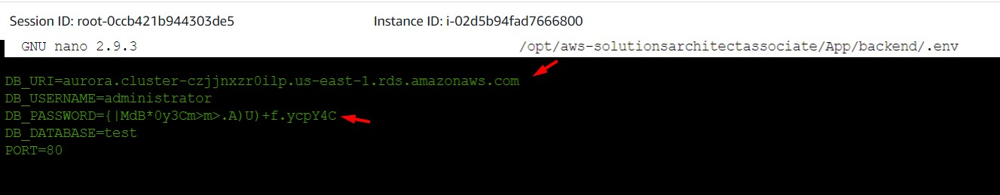

<br>

7. Desde la instancia "EC2 BACKEND" nos conectamos a Amazon RDS Aurora y creamos la base de datos "test" y la tabla "tasks" (recursos necesarios de la aplicación). Reemplazar los parámetros "$SECRETMANAGER_USER", "SECRETMANAGER_PASSWORD" y "$RDS_HOST" según aplique.

```bash
mysql -u $SECRETMANAGER_USER -h $RDS_HOST -p
#Ingresar contraseña $SECRETMANAGER_PASSWORD
create database test;
use test;
CREATE TABLE tasks
(
    id MEDIUMINT NOT NULL AUTO_INCREMENT,
    `name` VARCHAR(255),
    description VARCHAR(255),
    PRIMARY KEY (id)
    );
```

<br>

8. Ingresar a nuestra aplicación alojada en S3. Validar los nuevos registros ingresados en Amazon RDS Aurora.


```bash
mysql -u $SECRETMANAGER_USER -h $RDS_HOST -p
#Ingresar contraseña $SECRETMANAGER_PASSWORD
use test;
select * from tasks
```

<br>

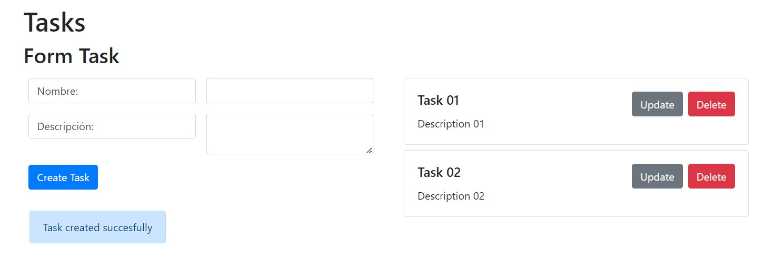

<br>

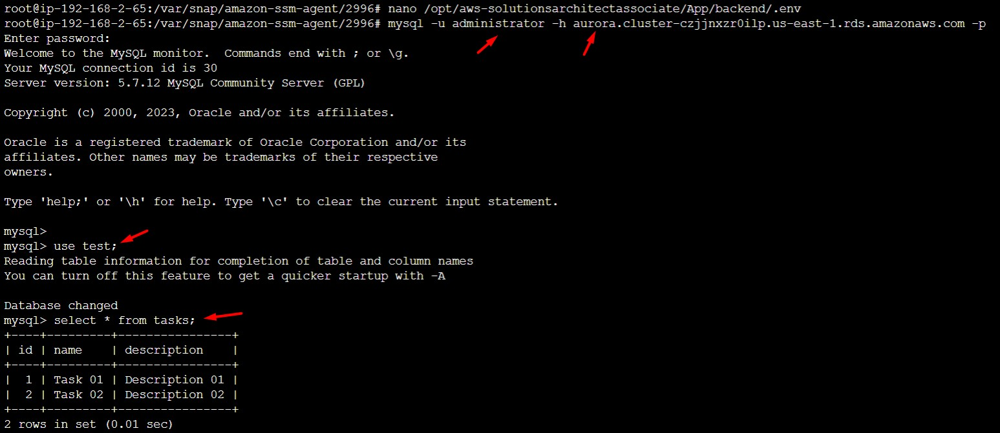

<br>

9. Ejecutamos los siguientes comandos desde MySQL. Validamos que nuestro usuario "administrator" está registrado correctamente. El valor "@@global.read_only" en "0" indica que la instancia NO es de sólo lectura.

```bash
#Comandos a ejecutar
SELECT user FROM mysql.user;
SELECT @@global.read_only;
select * from information_schema.user_privileges;

#Resultado
mysql> SELECT user FROM mysql.user;
+---------------+
| user          |
+---------------+
| administrator |
| mysql.sys     |
| rdsadmin      |
+---------------+
3 rows in set (0.01 sec)

mysql> SELECT @@global.read_only;
+--------------------+
| @@global.read_only |
+--------------------+
|                  0 |
+--------------------+
1 row in set (0.00 sec)

mysql> select * from information_schema.user_privileges;
+-------------------------+---------------+-------------------------+--------------+
| GRANTEE                 | TABLE_CATALOG | PRIVILEGE_TYPE          | IS_GRANTABLE |
+-------------------------+---------------+-------------------------+--------------+
| 'mysql.sys'@'localhost' | def           | USAGE                   | NO           |
| 'rdsadmin'@'localhost'  | def           | SELECT                  | YES          |
| 'rdsadmin'@'localhost'  | def           | INSERT                  | YES          |
| 'rdsadmin'@'localhost'  | def           | UPDATE                  | YES          |
| 'rdsadmin'@'localhost'  | def           | DELETE                  | YES          |
| 'rdsadmin'@'localhost'  | def           | CREATE                  | YES          |
| 'rdsadmin'@'localhost'  | def           | DROP                    | YES          |
| 'rdsadmin'@'localhost'  | def           | RELOAD                  | YES          |
| 'rdsadmin'@'localhost'  | def           | SHUTDOWN                | YES          |
| 'rdsadmin'@'localhost'  | def           | PROCESS                 | YES          |
| 'rdsadmin'@'localhost'  | def           | FILE                    | YES          |
| 'rdsadmin'@'localhost'  | def           | REFERENCES              | YES          |
| 'rdsadmin'@'localhost'  | def           | INDEX                   | YES          |
| 'rdsadmin'@'localhost'  | def           | ALTER                   | YES          |
| 'rdsadmin'@'localhost'  | def           | SHOW DATABASES          | YES          |
| 'rdsadmin'@'localhost'  | def           | SUPER                   | YES          |
| 'rdsadmin'@'localhost'  | def           | CREATE TEMPORARY TABLES | YES          |
| 'rdsadmin'@'localhost'  | def           | LOCK TABLES             | YES          |
| 'rdsadmin'@'localhost'  | def           | EXECUTE                 | YES          |
| 'rdsadmin'@'localhost'  | def           | REPLICATION SLAVE       | YES          |
| 'rdsadmin'@'localhost'  | def           | REPLICATION CLIENT      | YES          |
| 'rdsadmin'@'localhost'  | def           | CREATE VIEW             | YES          |
| 'rdsadmin'@'localhost'  | def           | SHOW VIEW               | YES          |
| 'rdsadmin'@'localhost'  | def           | CREATE ROUTINE          | YES          |
| 'rdsadmin'@'localhost'  | def           | ALTER ROUTINE           | YES          |
| 'rdsadmin'@'localhost'  | def           | CREATE USER             | YES          |
| 'rdsadmin'@'localhost'  | def           | EVENT                   | YES          |
| 'rdsadmin'@'localhost'  | def           | TRIGGER                 | YES          |
| 'rdsadmin'@'localhost'  | def           | CREATE TABLESPACE       | YES          |
| 'administrator'@'%'     | def           | SELECT                  | YES          |
| 'administrator'@'%'     | def           | INSERT                  | YES          |
| 'administrator'@'%'     | def           | UPDATE                  | YES          |
| 'administrator'@'%'     | def           | DELETE                  | YES          |
| 'administrator'@'%'     | def           | CREATE                  | YES          |
| 'administrator'@'%'     | def           | DROP                    | YES          |
| 'administrator'@'%'     | def           | RELOAD                  | YES          |
| 'administrator'@'%'     | def           | PROCESS                 | YES          |
| 'administrator'@'%'     | def           | REFERENCES              | YES          |
| 'administrator'@'%'     | def           | INDEX                   | YES          |
| 'administrator'@'%'     | def           | ALTER                   | YES          |
| 'administrator'@'%'     | def           | SHOW DATABASES          | YES          |
| 'administrator'@'%'     | def           | CREATE TEMPORARY TABLES | YES          |
| 'administrator'@'%'     | def           | LOCK TABLES             | YES          |
| 'administrator'@'%'     | def           | EXECUTE                 | YES          |
| 'administrator'@'%'     | def           | REPLICATION SLAVE       | YES          |
| 'administrator'@'%'     | def           | REPLICATION CLIENT      | YES          |
| 'administrator'@'%'     | def           | CREATE VIEW             | YES          |
| 'administrator'@'%'     | def           | SHOW VIEW               | YES          |
| 'administrator'@'%'     | def           | CREATE ROUTINE          | YES          |
| 'administrator'@'%'     | def           | ALTER ROUTINE           | YES          |
| 'administrator'@'%'     | def           | CREATE USER             | YES          |
| 'administrator'@'%'     | def           | EVENT                   | YES          |
| 'administrator'@'%'     | def           | TRIGGER                 | YES          |
+-------------------------+---------------+-------------------------+--------------+
53 rows in set (0.00 sec)
```

<br>